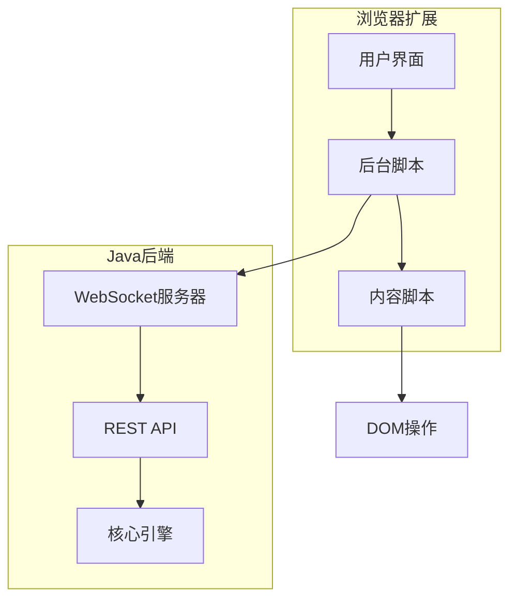

# Midscene Java 浏览器扩展方案

## 1. 原项目浏览器扩展分析

### 1.1 浏览器扩展功能

原项目 `midscene.js` 提供了Chrome浏览器扩展，实现零代码操作功能：<mcreference link="https://juejin.cn/post/7462264897654898715" index="1">1</mcreference>

1. **可视化录制**: 通过浏览器界面录制用户操作
2. **自然语言描述**: 支持用自然语言描述UI操作
3. **实时预览**: 实时预览操作效果
4. **代码生成**: 自动生成自动化脚本
5. **调试工具**: 提供调试和测试功能

### 1.2 扩展架构

原项目浏览器扩展采用以下架构：

1. **前端界面**: 使用React构建的用户界面
2. **内容脚本**: 注入到网页中的脚本，负责DOM操作
3. **后台脚本**: 处理扩展逻辑和与后端通信
4. **通信机制**: 使用Chrome消息传递API进行组件间通信

## 2. Java版本浏览器扩展设计

### 2.1 整体架构



### 2.2 通信机制

1. **扩展内部通信**: 使用Chrome消息传递API
2. **扩展与Java后端通信**: 使用WebSocket或HTTP API
3. **内容脚本与页面通信**: 使用DOM事件和postMessage

## 3. 扩展前端实现

### 3.1 扩展清单文件

```json
{
  "manifest_version": 3,
  "name": "Midscene Java",
  "version": "1.0.0",
  "description": "UI automation tool for Midscene Java",
  "permissions": [
    "activeTab",
    "storage",
    "scripting",
    "webNavigation"
  ],
  "host_permissions": [
    "http://localhost:*/*",
    "https://localhost:*/*"
  ],
  "background": {
    "service_worker": "background.js"
  },
  "content_scripts": [
    {
      "matches": ["<all_urls>"],
      "js": ["content.js"],
      "css": ["content.css"],
      "run_at": "document_idle"
    }
  ],
  "action": {
    "default_popup": "popup.html",
    "default_icon": {
      "16": "images/icon16.png",
      "48": "images/icon48.png",
      "128": "images/icon128.png"
    }
  },
  "icons": {
    "16": "images/icon16.png",
    "48": "images/icon48.png",
    "128": "images/icon128.png"
  },
  "web_accessible_resources": [
    {
      "resources": ["images/*", "fonts/*"],
      "matches": ["<all_urls>"]
    }
  ]
}
```

### 3.2 后台脚本

```javascript
// background.js
import { MidsceneClient } from './midscene-client.js';

// 初始化Midscene客户端
const midsceneClient = new MidsceneClient('ws://localhost:8080/midscene-ws');

// 监听来自弹出窗口的消息
chrome.runtime.onMessage.addListener((message, sender, sendResponse) => {
  handleExtensionMessage(message, sender, sendResponse);
  return true; // 保持消息通道开放以支持异步响应
});

// 监听标签页更新
chrome.tabs.onUpdated.addListener((tabId, changeInfo, tab) => {
  if (changeInfo.status === 'complete' && tab.url) {
    // 通知内容脚本页面已加载
    chrome.tabs.sendMessage(tabId, { type: 'PAGE_LOADED', url: tab.url });
  }
});

// 处理扩展消息
async function handleExtensionMessage(message, sender, sendResponse) {
  try {
    switch (message.type) {
      case 'INITIALIZE_EXTENSION':
        await initializeExtension();
        sendResponse({ success: true });
        break;
        
      case 'EXECUTE_ACTION':
        const actionResult = await executeAction(message.action);
        sendResponse({ success: true, result: actionResult });
        break;
        
      case 'QUERY_ELEMENTS':
        const elements = await queryElements(message.query);
        sendResponse({ success: true, elements });
        break;
        
      case 'TAKE_SCREENSHOT':
        const screenshot = await takeScreenshot(sender.tab.id);
        sendResponse({ success: true, screenshot });
        break;
        
      case 'GET_PAGE_INFO':
        const pageInfo = await getPageInfo(sender.tab.id);
        sendResponse({ success: true, pageInfo });
        break;
        
      default:
        sendResponse({ success: false, error: 'Unknown message type' });
    }
  } catch (error) {
    sendResponse({ success: false, error: error.message });
  }
}

// 初始化扩展
async function initializeExtension() {
  try {
    await midsceneClient.connect();
    console.log('Midscene extension initialized');
  } catch (error) {
    console.error('Failed to initialize Midscene extension:', error);
  }
}

// 执行操作
async function executeAction(action) {
  try {
    const result = await midsceneClient.executeAction(action);
    return result;
  } catch (error) {
    console.error('Failed to execute action:', error);
    throw error;
  }
}

// 查询元素
async function queryElements(query) {
  try {
    const elements = await midsceneClient.queryElements(query);
    return elements;
  } catch (error) {
    console.error('Failed to query elements:', error);
    throw error;
  }
}

// 截图
async function takeScreenshot(tabId) {
  try {
    // 使用Chrome截图API
    const dataUrl = await chrome.tabs.captureVisibleTab(null, { format: 'png' });
    return dataUrl;
  } catch (error) {
    console.error('Failed to take screenshot:', error);
    throw error;
  }
}

// 获取页面信息
async function getPageInfo(tabId) {
  try {
    const tab = await chrome.tabs.get(tabId);
    return {
      id: tab.id,
      url: tab.url,
      title: tab.title
    };
  } catch (error) {
    console.error('Failed to get page info:', error);
    throw error;
  }
}
```

### 3.3 内容脚本

```javascript
// content.js
import { ElementHighlighter } from './element-highlighter.js';
import { ElementSelector } from './element-selector.js';

// 初始化元素高亮器和选择器
const elementHighlighter = new ElementHighlighter();
const elementSelector = new ElementSelector();

// 监听来自后台脚本的消息
chrome.runtime.onMessage.addListener((message, sender, sendResponse) => {
  handleContentMessage(message, sender, sendResponse);
  return true;
});

// 监听DOM事件
document.addEventListener('DOMContentLoaded', () => {
  initializeContentScript();
});

// 处理内容脚本消息
function handleContentMessage(message, sender, sendResponse) {
  try {
    switch (message.type) {
      case 'PAGE_LOADED':
        handlePageLoaded();
        sendResponse({ success: true });
        break;
        
      case 'HIGHLIGHT_ELEMENTS':
        highlightElements(message.selectors);
        sendResponse({ success: true });
        break;
        
      case 'CLEAR_HIGHLIGHTS':
        clearHighlights();
        sendResponse({ success: true });
        break;
        
      case 'GET_ELEMENT_INFO':
        const elementInfo = getElementInfo(message.selector);
        sendResponse({ success: true, elementInfo });
        break;
        
      default:
        sendResponse({ success: false, error: 'Unknown message type' });
    }
  } catch (error) {
    sendResponse({ success: false, error: error.message });
  }
}

// 初始化内容脚本
function initializeContentScript() {
  // 注入必要的CSS
  injectStyles();
  
  // 初始化元素选择器
  elementSelector.initialize();
  
  // 监听页面变化
  observePageChanges();
  
  console.log('Midscene content script initialized');
}

// 处理页面加载
function handlePageLoaded() {
  // 清除之前的高亮
  clearHighlights();
  
  // 重新初始化元素选择器
  elementSelector.initialize();
}

// 高亮元素
function highlightElements(selectors) {
  clearHighlights();
  
  for (const selector of selectors) {
    const elements = document.querySelectorAll(selector);
    for (const element of elements) {
      elementHighlighter.highlight(element);
    }
  }
}

// 清除高亮
function clearHighlights() {
  elementHighlighter.clearAll();
}

// 获取元素信息
function getElementInfo(selector) {
  const element = document.querySelector(selector);
  if (!element) {
    return null;
  }
  
  const rect = element.getBoundingClientRect();
  return {
    tagName: element.tagName,
    text: element.textContent,
    id: element.id,
    className: element.className,
    attributes: getAttributes(element),
    bounds: {
      x: rect.left,
      y: rect.top,
      width: rect.width,
      height: rect.height
    }
  };
}

// 获取元素属性
function getAttributes(element) {
  const attributes = {};
  for (const attr of element.attributes) {
    attributes[attr.name] = attr.value;
  }
  return attributes;
}

// 注入样式
function injectStyles() {
  const style = document.createElement('link');
  style.rel = 'stylesheet';
  style.type = 'text/css';
  style.href = chrome.runtime.getURL('content.css');
  document.head.appendChild(style);
}

// 监听页面变化
function observePageChanges() {
  const observer = new MutationObserver((mutations) => {
    let shouldNotify = false;
    
    for (const mutation of mutations) {
      if (mutation.type === 'childList' && mutation.addedNodes.length > 0) {
        shouldNotify = true;
        break;
      }
    }
    
    if (shouldNotify) {
      // 通知后台脚本页面已变化
      chrome.runtime.sendMessage({ type: 'PAGE_CHANGED' });
    }
  });
  
  observer.observe(document.body, {
    childList: true,
    subtree: true
  });
}
```

### 3.4 元素高亮器

```javascript
// element-highlighter.js
export class ElementHighlighter {
  constructor() {
    this.highlightedElements = new Map();
    this.highlightId = 0;
  }
  
  /**
   * 高亮元素
   * @param {Element} element 要高亮的元素
   * @param {Object} options 高亮选项
   * @returns {number} 高亮ID
   */
  highlight(element, options = {}) {
    const id = this.highlightId++;
    
    // 创建高亮覆盖层
    const overlay = document.createElement('div');
    overlay.className = 'midscene-highlight-overlay';
    overlay.setAttribute('data-highlight-id', id);
    
    // 获取元素位置和大小
    const rect = element.getBoundingClientRect();
    
    // 设置覆盖层样式
    Object.assign(overlay.style, {
      position: 'absolute',
      left: `${rect.left + window.scrollX}px`,
      top: `${rect.top + window.scrollY}px`,
      width: `${rect.width}px`,
      height: `${rect.height}px`,
      backgroundColor: options.color || 'rgba(255, 0, 0, 0.3)',
      border: options.border || '2px solid red',
      pointerEvents: 'none',
      zIndex: '10000',
      borderRadius: '3px',
      boxSizing: 'border-box'
    });
    
    // 添加标签
    if (options.label) {
      const label = document.createElement('div');
      label.className = 'midscene-highlight-label';
      label.textContent = options.label;
      Object.assign(label.style, {
        position: 'absolute',
        top: '-25px',
        left: '0',
        backgroundColor: 'rgba(0, 0, 0, 0.7)',
        color: 'white',
        padding: '2px 6px',
        fontSize: '12px',
        borderRadius: '3px',
        whiteSpace: 'nowrap'
      });
      overlay.appendChild(label);
    }
    
    // 添加到页面
    document.body.appendChild(overlay);
    
    // 保存高亮信息
    this.highlightedElements.set(id, {
      element,
      overlay,
      options
    });
    
    return id;
  }
  
  /**
   * 移除高亮
   * @param {number} id 高亮ID
   */
  removeHighlight(id) {
    const highlightInfo = this.highlightedElements.get(id);
    if (highlightInfo) {
      document.body.removeChild(highlightInfo.overlay);
      this.highlightedElements.delete(id);
    }
  }
  
  /**
   * 清除所有高亮
   */
  clearAll() {
    for (const [id, highlightInfo] of this.highlightedElements) {
      document.body.removeChild(highlightInfo.overlay);
    }
    this.highlightedElements.clear();
  }
  
  /**
   * 更新高亮位置
   */
  updateHighlights() {
    for (const [id, highlightInfo] of this.highlightedElements) {
      const rect = highlightInfo.element.getBoundingClientRect();
      highlightInfo.overlay.style.left = `${rect.left + window.scrollX}px`;
      highlightInfo.overlay.style.top = `${rect.top + window.scrollY}px`;
      highlightInfo.overlay.style.width = `${rect.width}px`;
      highlightInfo.overlay.style.height = `${rect.height}px`;
    }
  }
}
```

### 3.5 元素选择器

```javascript
// element-selector.js
export class ElementSelector {
  constructor() {
    this.isSelecting = false;
    this.selectedElement = null;
    this.onSelectCallback = null;
    this.highlighter = null;
  }
  
  /**
   * 初始化元素选择器
   */
  initialize() {
    this.highlighter = new ElementHighlighter();
    this.setupEventListeners();
  }
  
  /**
   * 开始选择元素
   * @param {Function} onSelect 选择回调函数
   */
  startSelection(onSelect) {
    if (this.isSelecting) {
      return;
    }
    
    this.isSelecting = true;
    this.onSelectCallback = onSelect;
    document.body.style.cursor = 'crosshair';
    
    // 显示提示
    this.showSelectionHint();
  }
  
  /**
   * 停止选择元素
   */
  stopSelection() {
    if (!this.isSelecting) {
      return;
    }
    
    this.isSelecting = false;
    this.onSelectCallback = null;
    document.body.style.cursor = '';
    
    // 清除高亮
    this.highlighter.clearAll();
    
    // 隐藏提示
    this.hideSelectionHint();
  }
  
  /**
   * 设置事件监听器
   */
  setupEventListeners() {
    // 鼠标移动事件
    document.addEventListener('mousemove', this.handleMouseMove.bind(this));
    
    // 鼠标点击事件
    document.addEventListener('click', this.handleClick.bind(this));
    
    // 键盘事件
    document.addEventListener('keydown', this.handleKeyDown.bind(this));
  }
  
  /**
   * 处理鼠标移动
   */
  handleMouseMove(event) {
    if (!this.isSelecting) {
      return;
    }
    
    // 清除之前的高亮
    this.highlighter.clearAll();
    
    // 获取鼠标下的元素
    const element = document.elementFromPoint(event.clientX, event.clientY);
    if (element && element !== document.body && element !== document.documentElement) {
      // 高亮元素
      this.highlighter.highlight(element, {
        color: 'rgba(0, 123, 255, 0.3)',
        border: '2px solid #007bff'
      });
      
      // 更新提示
      this.updateSelectionHint(element);
    }
  }
  
  /**
   * 处理鼠标点击
   */
  handleClick(event) {
    if (!this.isSelecting) {
      return;
    }
    
    // 阻止默认行为和事件冒泡
    event.preventDefault();
    event.stopPropagation();
    
    // 获取点击的元素
    const element = event.target;
    if (element && element !== document.body && element !== document.documentElement) {
      this.selectedElement = element;
      
      // 调用选择回调
      if (this.onSelectCallback) {
        this.onSelectCallback(element);
      }
    }
    
    // 停止选择
    this.stopSelection();
  }
  
  /**
   * 处理键盘事件
   */
  handleKeyDown(event) {
    if (!this.isSelecting) {
      return;
    }
    
    // ESC键取消选择
    if (event.key === 'Escape') {
      this.stopSelection();
    }
  }
  
  /**
   * 显示选择提示
   */
  showSelectionHint() {
    const hint = document.createElement('div');
    hint.id = 'midscene-selection-hint';
    hint.textContent = '点击选择元素，按ESC取消';
    Object.assign(hint.style, {
      position: 'fixed',
      top: '10px',
      left: '50%',
      transform: 'translateX(-50%)',
      backgroundColor: 'rgba(0, 0, 0, 0.7)',
      color: 'white',
      padding: '8px 16px',
      borderRadius: '4px',
      fontSize: '14px',
      zIndex: '10001',
      pointerEvents: 'none'
    });
    
    document.body.appendChild(hint);
  }
  
  /**
   * 隐藏选择提示
   */
  hideSelectionHint() {
    const hint = document.getElementById('midscene-selection-hint');
    if (hint) {
      document.body.removeChild(hint);
    }
  }
  
  /**
   * 更新选择提示
   */
  updateSelectionHint(element) {
    const hint = document.getElementById('midscene-selection-hint');
    if (hint && element) {
      const tagName = element.tagName.toLowerCase();
      const id = element.id ? `#${element.id}` : '';
      const className = element.className ? `.${element.className.split(' ').join('.')}` : '';
      const selector = `${tagName}${id}${className}`;
      
      hint.textContent = `选择: ${selector}`;
    }
  }
}
```

### 3.6 弹出窗口

```html
<!-- popup.html -->
<!DOCTYPE html>
<html>
<head>
  <meta charset="utf-8">
  <title>Midscene Java</title>
  <link rel="stylesheet" href="popup.css">
</head>
<body>
  <div class="container">
    <header class="header">
      
      <h1>Midscene Java</h1>
    </header>
    
    <main class="main">
      <div class="tab-container">
        <div class="tabs">
          <button class="tab-button active" data-tab="record">录制</button>
          <button class="tab-button" data-tab="execute">执行</button>
          <button class="tab-button" data-tab="settings">设置</button>
        </div>
        
        <div class="tab-content">
          <!-- 录制标签页 -->
          <div id="record-tab" class="tab-pane active">
            <div class="control-panel">
              <button id="start-recording" class="btn btn-primary">开始录制</button>
              <button id="stop-recording" class="btn btn-secondary" disabled>停止录制</button>
              <button id="clear-actions" class="btn btn-secondary">清除操作</button>
            </div>
            
            <div class="actions-list">
              <h3>录制的操作</h3>
              <ul id="recorded-actions" class="action-list"></ul>
            </div>
            
            <div class="code-panel">
              <h3>生成的代码</h3>
              <div class="code-container">
                <pre id="generated-code" class="code"></pre>
                <button id="copy-code" class="btn btn-small">复制代码</button>
              </div>
            </div>
          </div>
          
          <!-- 执行标签页 -->
          <div id="execute-tab" class="tab-pane">
            <div class="input-panel">
              <h3>自然语言指令</h3>
              <textarea id="instruction" placeholder="输入自然语言指令，例如：点击登录按钮"></textarea>
              <button id="execute-instruction" class="btn btn-primary">执行</button>
            </div>
            
            <div class="result-panel">
              <h3>执行结果</h3>
              <div id="execution-result" class="result"></div>
            </div>
          </div>
          
          <!-- 设置标签页 -->
          <div id="settings-tab" class="tab-pane">
            <div class="settings-panel">
              <h3>连接设置</h3>
              <div class="form-group">
                <label for="server-url">服务器URL:</label>
                <input type="text" id="server-url" value="ws://localhost:8080/midscene-ws">
              </div>
              
              <div class="form-group">
                <label for="api-key">API密钥:</label>
                <input type="password" id="api-key">
              </div>
              
              <button id="save-settings" class="btn btn-primary">保存设置</button>
              <button id="test-connection" class="btn btn-secondary">测试连接</button>
            </div>
            
            <div class="status-panel">
              <h3>连接状态</h3>
              <div id="connection-status" class="status">未连接</div>
            </div>
          </div>
        </div>
      </div>
    </main>
  </div>
  
  <script src="popup.js"></script>
</body>
</html>
```

```javascript
// popup.js
import { MidsceneClient } from './midscene-client.js';

// 初始化Midscene客户端
let midsceneClient;

// DOM元素
const startRecordingBtn = document.getElementById('start-recording');
const stopRecordingBtn = document.getElementById('stop-recording');
const clearActionsBtn = document.getElementById('clear-actions');
const recordedActionsList = document.getElementById('recorded-actions');
const generatedCodeElement = document.getElementById('generated-code');
const copyCodeBtn = document.getElementById('copy-code');
const instructionTextarea = document.getElementById('instruction');
const executeInstructionBtn = document.getElementById('execute-instruction');
const executionResultElement = document.getElementById('execution-result');
const serverUrlInput = document.getElementById('server-url');
const apiKeyInput = document.getElementById('api-key');
const saveSettingsBtn = document.getElementById('save-settings');
const testConnectionBtn = document.getElementById('test-connection');
const connectionStatusElement = document.getElementById('connection-status');

// 录制状态
let isRecording = false;
let recordedActions = [];

// 初始化
document.addEventListener('DOMContentLoaded', async () => {
  // 加载设置
  await loadSettings();
  
  // 初始化客户端
  initializeClient();
  
  // 设置事件监听器
  setupEventListeners();
  
  // 初始化标签页
  initializeTabs();
});

// 初始化客户端
function initializeClient() {
  const serverUrl = serverUrlInput.value;
  const apiKey = apiKeyInput.value;
  
  midsceneClient = new MidsceneClient(serverUrl, apiKey);
  
  // 监听连接状态
  midsceneClient.on('connected', () => {
    updateConnectionStatus('已连接', 'success');
  });
  
  midsceneClient.on('disconnected', () => {
    updateConnectionStatus('已断开', 'error');
  });
  
  midsceneClient.on('error', (error) => {
    updateConnectionStatus(`错误: ${error.message}`, 'error');
  });
  
  // 连接服务器
  midsceneClient.connect();
}

// 设置事件监听器
function setupEventListeners() {
  // 录制控制
  startRecordingBtn.addEventListener('click', startRecording);
  stopRecordingBtn.addEventListener('click', stopRecording);
  clearActionsBtn.addEventListener('click', clearActions);
  copyCodeBtn.addEventListener('click', copyGeneratedCode);
  
  // 执行控制
  executeInstructionBtn.addEventListener('click', executeInstruction);
  
  // 设置控制
  saveSettingsBtn.addEventListener('click', saveSettings);
  testConnectionBtn.addEventListener('click', testConnection);
}

// 初始化标签页
function initializeTabs() {
  const tabButtons = document.querySelectorAll('.tab-button');
  const tabPanes = document.querySelectorAll('.tab-pane');
  
  tabButtons.forEach(button => {
    button.addEventListener('click', () => {
      const tabName = button.getAttribute('data-tab');
      
      // 更新按钮状态
      tabButtons.forEach(btn => btn.classList.remove('active'));
      button.classList.add('active');
      
      // 更新内容显示
      tabPanes.forEach(pane => {
        if (pane.id === `${tabName}-tab`) {
          pane.classList.add('active');
        } else {
          pane.classList.remove('active');
        }
      });
    });
  });
}

// 开始录制
async function startRecording() {
  try {
    // 发送开始录制消息到后台脚本
    const response = await chrome.runtime.sendMessage({
      type: 'START_RECORDING'
    });
    
    if (response.success) {
      isRecording = true;
      startRecordingBtn.disabled = true;
      stopRecordingBtn.disabled = false;
      recordedActions = [];
      updateActionsList();
      updateGeneratedCode();
    } else {
      alert('开始录制失败: ' + response.error);
    }
  } catch (error) {
    alert('开始录制失败: ' + error.message);
  }
}

// 停止录制
async function stopRecording() {
  try {
    // 发送停止录制消息到后台脚本
    const response = await chrome.runtime.sendMessage({
      type: 'STOP_RECORDING'
    });
    
    if (response.success) {
      isRecording = false;
      startRecordingBtn.disabled = false;
      stopRecordingBtn.disabled = true;
    } else {
      alert('停止录制失败: ' + response.error);
    }
  } catch (error) {
    alert('停止录制失败: ' + error.message);
  }
}

// 清除操作
function clearActions() {
  recordedActions = [];
  updateActionsList();
  updateGeneratedCode();
}

// 更新操作列表
function updateActionsList() {
  recordedActionsList.innerHTML = '';
  
  recordedActions.forEach((action, index) => {
    const li = document.createElement('li');
    li.className = 'action-item';
    li.textContent = `${index + 1}. ${action.description}`;
    recordedActionsList.appendChild(li);
  });
}

// 更新生成的代码
function updateGeneratedCode() {
  if (recordedActions.length === 0) {
    generatedCodeElement.textContent = '// 暂无录制的操作';
    return;
  }
  
  let code = 'import com.midscene.core.Midscene;\nimport com.midscene.core.agent.Agent;\n\n';
  code += 'public class RecordedScript {\n';
  code += '    public static void main(String[] args) {\n';
  code += '        try {\n';
  code += '            Agent agent = new Agent();\n\n';
  
  recordedActions.forEach(action => {
    code += `            // ${action.description}\n`;
    code += `            agent.aiAction("${action.instruction}");\n\n`;
  });
  
  code += '        } catch (Exception e) {\n';
  code += '            e.printStackTrace();\n';
  code += '        }\n';
  code += '    }\n';
  code += '}';
  
  generatedCodeElement.textContent = code;
}

// 复制生成的代码
function copyGeneratedCode() {
  const code = generatedCodeElement.textContent;
  navigator.clipboard.writeText(code).then(() => {
    // 显示复制成功提示
    const originalText = copyCodeBtn.textContent;
    copyCodeBtn.textContent = '已复制!';
    copyCodeBtn.disabled = true;
    
    setTimeout(() => {
      copyCodeBtn.textContent = originalText;
      copyCodeBtn.disabled = false;
    }, 2000);
  }).catch(error => {
    alert('复制失败: ' + error.message);
  });
}

// 执行指令
async function executeInstruction() {
  const instruction = instructionTextarea.value.trim();
  if (!instruction) {
    alert('请输入指令');
    return;
  }
  
  try {
    // 显示加载状态
    executionResultElement.innerHTML = '<div class="loading">执行中...</div>';
    
    // 发送执行指令消息到后台脚本
    const response = await chrome.runtime.sendMessage({
      type: 'EXECUTE_INSTRUCTION',
      instruction
    });
    
    if (response.success) {
      executionResultElement.innerHTML = `
        <div class="success">
          <h4>执行成功</h4>
          <pre>${JSON.stringify(response.result, null, 2)}</pre>
        </div>
      `;
    } else {
      executionResultElement.innerHTML = `
        <div class="error">
          <h4>执行失败</h4>
          <p>${response.error}</p>
        </div>
      `;
    }
  } catch (error) {
    executionResultElement.innerHTML = `
      <div class="error">
        <h4>执行失败</h4>
        <p>${error.message}</p>
      </div>
    `;
  }
}

// 加载设置
async function loadSettings() {
  try {
    const settings = await chrome.storage.sync.get({
      serverUrl: 'ws://localhost:8080/midscene-ws',
      apiKey: ''
    });
    
    serverUrlInput.value = settings.serverUrl;
    apiKeyInput.value = settings.apiKey;
  } catch (error) {
    console.error('加载设置失败:', error);
  }
}

// 保存设置
async function saveSettings() {
  try {
    await chrome.storage.sync.set({
      serverUrl: serverUrlInput.value,
      apiKey: apiKeyInput.value
    });
    
    // 重新初始化客户端
    midsceneClient.disconnect();
    initializeClient();
    
    // 显示保存成功提示
    const originalText = saveSettingsBtn.textContent;
    saveSettingsBtn.textContent = '已保存';
    saveSettingsBtn.disabled = true;
    
    setTimeout(() => {
      saveSettingsBtn.textContent = originalText;
      saveSettingsBtn.disabled = false;
    }, 2000);
  } catch (error) {
    alert('保存设置失败: ' + error.message);
  }
}

// 测试连接
async function testConnection() {
  try {
    // 显示测试中状态
    const originalText = testConnectionBtn.textContent;
    testConnectionBtn.textContent = '测试中...';
    testConnectionBtn.disabled = true;
    
    // 断开现有连接
    midsceneClient.disconnect();
    
    // 创建测试客户端
    const testClient = new MidsceneClient(serverUrlInput.value, apiKeyInput.value);
    
    // 连接测试
    await testClient.connect();
    testClient.disconnect();
    
    // 显示测试成功
    updateConnectionStatus('连接成功', 'success');
  } catch (error) {
    updateConnectionStatus(`连接失败: ${error.message}`, 'error');
  } finally {
    // 恢复按钮状态
    testConnectionBtn.textContent = '测试连接';
    testConnectionBtn.disabled = false;
  }
}

// 更新连接状态
function updateConnectionStatus(message, type) {
  connectionStatusElement.textContent = message;
  connectionStatusElement.className = `status ${type}`;
}

// 监听来自后台脚本的消息
chrome.runtime.onMessage.addListener((message, sender, sendResponse) => {
  if (message.type === 'ACTION_RECORDED') {
    // 添加录制的操作
    recordedActions.push(message.action);
    updateActionsList();
    updateGeneratedCode();
  }
});
```

## 4. Java后端WebSocket服务

### 4.1 WebSocket端点实现

```java
package com.midscene.web.websocket;

import com.midscene.core.agent.Agent;
import com.midscene.core.model.ActionRequest;
import com.midscene.core.model.ActionResponse;
import com.midscene.core.model.QueryRequest;
import com.midscene.core.model.QueryResponse;
import com.fasterxml.jackson.databind.ObjectMapper;
import jakarta.websocket.*;
import jakarta.websocket.server.ServerEndpoint;
import java.io.IOException;
import java.util.Map;
import java.util.concurrent.ConcurrentHashMap;

/**
 * Midscene WebSocket端点
 */
@ServerEndpoint("/midscene-ws")
public class MidsceneWebSocketEndpoint {
    private static final Map<String, Session> sessions = new ConcurrentHashMap<>();
    private static final ObjectMapper objectMapper = new ObjectMapper();
    private Agent agent;
    
    @OnOpen
    public void onOpen(Session session) {
        sessions.put(session.getId(), session);
        System.out.println("WebSocket opened: " + session.getId());
        
        // 初始化Agent
        try {
            agent = new Agent();
            sendJsonMessage(session, Map.of("type", "connected"));
        } catch (Exception e) {
            sendErrorMessage(session, "Failed to initialize agent: " + e.getMessage());
        }
    }
    
    @OnMessage
    public void onMessage(String message, Session session) {
        try {
            Map<String, Object> request = objectMapper.readValue(message, Map.class);
            String type = (String) request.get("type");
            
            switch (type) {
                case "executeAction":
                    handleExecuteAction(request, session);
                    break;
                    
                case "queryElements":
                    handleQueryElements(request, session);
                    break;
                    
                case "takeScreenshot":
                    handleTakeScreenshot(session);
                    break;
                    
                default:
                    sendErrorMessage(session, "Unknown request type: " + type);
            }
        } catch (Exception e) {
            sendErrorMessage(session, "Error processing message: " + e.getMessage());
        }
    }
    
    @OnClose
    public void onClose(Session session) {
        sessions.remove(session.getId());
        System.out.println("WebSocket closed: " + session.getId());
        
        // 清理Agent资源
        if (agent != null) {
            agent.close();
        }
    }
    
    @OnError
    public void onError(Session session, Throwable error) {
        sessions.remove(session.getId());
        System.out.println("WebSocket error: " + error.getMessage());
        error.printStackTrace();
        
        // 清理Agent资源
        if (agent != null) {
            agent.close();
        }
    }
    
    /**
     * 处理执行操作请求
     */
    private void handleExecuteAction(Map<String, Object> request, Session session) {
        try {
            Map<String, Object> actionData = (Map<String, Object>) request.get("action");
            ActionRequest actionRequest = new ActionRequest();
            actionRequest.setInstruction((String) actionData.get("instruction"));
            actionRequest.setParameters((Map<String, Object>) actionData.get("parameters"));
            
            ActionResponse response = agent.aiAction(actionRequest);
            
            sendJsonMessage(session, Map.of(
                "type", "actionResponse",
                "success", true,
                "result", response
            ));
        } catch (Exception e) {
            sendErrorMessage(session, "Failed to execute action: " + e.getMessage());
        }
    }
    
    /**
     * 处理查询元素请求
     */
    private void handleQueryElements(Map<String, Object> request, Session session) {
        try {
            Map<String, Object> queryData = (Map<String, Object>) request.get("query");
            QueryRequest queryRequest = new QueryRequest();
            queryRequest.setQuery((String) queryData.get("query"));
            queryRequest.setParameters((Map<String, Object>) queryData.get("parameters"));
            
            QueryResponse response = agent.aiQuery(queryRequest);
            
            sendJsonMessage(session, Map.of(
                "type", "queryResponse",
                "success", true,
                "result", response
            ));
        } catch (Exception e) {
            sendErrorMessage(session, "Failed to query elements: " + e.getMessage());
        }
    }
    
    /**
     * 处理截图请求
     */
    private void handleTakeScreenshot(Session session) {
        try {
            String screenshot = agent.takeScreenshot();
            
            sendJsonMessage(session, Map.of(
                "type", "screenshotResponse",
                "success", true,
                "screenshot", screenshot
            ));
        } catch (Exception e) {
            sendErrorMessage(session, "Failed to take screenshot: " + e.getMessage());
        }
    }
    
    /**
     * 发送JSON消息
     */
    private void sendJsonMessage(Session session, Object message) {
        try {
            String jsonMessage = objectMapper.writeValueAsString(message);
            session.getBasicRemote().sendText(jsonMessage);
        } catch (IOException e) {
            System.err.println("Failed to send message: " + e.getMessage());
        }
    }
    
    /**
     * 发送错误消息
     */
    private void sendErrorMessage(Session session, String error) {
        sendJsonMessage(session, Map.of(
            "type", "error",
            "success", false,
            "error", error
        ));
    }
}
```

### 4.2 REST API端点

```java
package com.midscene.web.api;

import com.midscene.core.agent.Agent;
import com.midscene.core.model.ActionRequest;
import com.midscene.core.model.ActionResponse;
import com.midscene.core.model.QueryRequest;
import com.midscene.core.model.QueryResponse;
import com.fasterxml.jackson.databind.ObjectMapper;
import jakarta.ws.rs.*;
import jakarta.ws.rs.core.MediaType;
import jakarta.ws.rs.core.Response;
import java.util.Map;

/**
 * Midscene REST API端点
 */
@Path("/midscene-api")
@Produces(MediaType.APPLICATION_JSON)
@Consumes(MediaType.APPLICATION_JSON)
public class MidsceneApiEndpoint {
    private static final ObjectMapper objectMapper = new ObjectMapper();
    private Agent agent;
    
    public MidsceneApiEndpoint() {
        try {
            agent = new Agent();
        } catch (Exception e) {
            throw new RuntimeException("Failed to initialize agent", e);
        }
    }
    
    /**
     * 执行操作
     */
    @POST
    @Path("/action")
    public Response executeAction(Map<String, Object> request) {
        try {
            Map<String, Object> actionData = (Map<String, Object>) request.get("action");
            ActionRequest actionRequest = new ActionRequest();
            actionRequest.setInstruction((String) actionData.get("instruction"));
            actionRequest.setParameters((Map<String, Object>) actionData.get("parameters"));
            
            ActionResponse response = agent.aiAction(actionRequest);
            
            return Response.ok(Map.of(
                "success", true,
                "result", response
            )).build();
        } catch (Exception e) {
            return Response.status(Response.Status.INTERNAL_SERVER_ERROR)
                .entity(Map.of(
                    "success", false,
                    "error", e.getMessage()
                ))
                .build();
        }
    }
    
    /**
     * 查询元素
     */
    @POST
    @Path("/query")
    public Response queryElements(Map<String, Object> request) {
        try {
            Map<String, Object> queryData = (Map<String, Object>) request.get("query");
            QueryRequest queryRequest = new QueryRequest();
            queryRequest.setQuery((String) queryData.get("query"));
            queryRequest.setParameters((Map<String, Object>) queryData.get("parameters"));
            
            QueryResponse response = agent.aiQuery(queryRequest);
            
            return Response.ok(Map.of(
                "success", true,
                "result", response
            )).build();
        } catch (Exception e) {
            return Response.status(Response.Status.INTERNAL_SERVER_ERROR)
                .entity(Map.of(
                    "success", false,
                    "error", e.getMessage()
                ))
                .build();
        }
    }
    
    /**
     * 截图
     */
    @GET
    @Path("/screenshot")
    public Response takeScreenshot() {
        try {
            String screenshot = agent.takeScreenshot();
            
            return Response.ok(Map.of(
                "success", true,
                "screenshot", screenshot
            )).build();
        } catch (Exception e) {
            return Response.status(Response.Status.INTERNAL_SERVER_ERROR)
                .entity(Map.of(
                    "success", false,
                    "error", e.getMessage()
                ))
                .build();
        }
    }
}
```

## 5. 实施计划

### 5.1 第一阶段：扩展基础框架 (1周)

1. 创建扩展清单文件
2. 实现基本的后台脚本
3. 实现内容脚本框架
4. 实现基本的弹出窗口
5. 设置扩展与Java后端的通信机制

### 5.2 第二阶段：元素选择和高亮 (1周)

1. 实现元素高亮器
2. 实现元素选择器
3. 实现DOM操作工具
4. 实现页面变化监听

### 5.3 第三阶段：录制功能 (1周)

1. 实现操作录制功能
2. 实现操作列表显示
3. 实现代码生成功能
4. 实现代码复制功能

### 5.4 第四阶段：执行功能 (1周)

1. 实现自然语言指令输入
2. 实现指令执行功能
3. 实现执行结果显示
4. 实现错误处理

### 5.5 第五阶段：设置和连接 (1周)

1. 实现设置界面
2. 实现连接管理
3. 实现连接状态显示
4. 实现连接测试功能

### 5.6 第六阶段：Java后端集成 (1周)

1. 实现WebSocket端点
2. 实现REST API端点
3. 集成Agent核心功能
4. 实现错误处理和日志记录

## 6. 总结

通过本方案，我们将为Midscene Java项目实现与原项目相同的浏览器扩展功能，包括可视化录制、自然语言描述、实时预览、代码生成和调试工具。这将使用户能够通过浏览器界面轻松创建和测试UI自动化脚本，大大提高使用体验和工作效率。