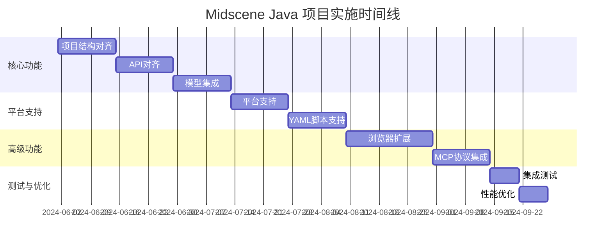

# Midscene Java 项目完整实施方案

## 1. 项目概述

本方案旨在将 Midscene Java 项目与 GitHub 原项目 `https://github.com/web-infra-dev/midscene` 保持一致的项目结构，并实现完全相同的功能与效果。基于对原项目的深入分析，我们已经制定了以下关键方案：

1. 项目结构对齐方案
2. API对齐方案
3. 模型集成方案
4. 平台支持方案
5. 浏览器扩展方案
6. MCP协议集成方案
7. YAML脚本支持方案

## 2. 实施优先级与时间线

### 2.1 优先级排序

1. **高优先级 (P0)**: 核心功能和API
   - 项目结构对齐
   - API对齐
   - 模型集成

2. **中优先级 (P1)**: 平台支持和扩展功能
   - 平台支持
   - YAML脚本支持

3. **低优先级 (P2)**: 高级功能和集成
   - 浏览器扩展
   - MCP协议集成

### 2.2 总体时间线

## 3. 详细实施计划

### 3.1 第一阶段：核心功能实现 (6周)

#### 3.1.1 项目结构对齐 (2周)

**目标**: 建立与原项目一致的目录结构和模块划分

**关键任务**:
1. 重组项目目录结构
   - 创建 `packages/` 目录及其子模块
   - 创建 `apps/` 目录及其应用
   - 调整现有代码到新结构

2. 实现核心模块
   - `midscene-core`: 核心功能实现
   - `midscene-common`: 公共组件和工具

3. 更新构建配置
   - Maven多模块配置
   - 依赖管理优化

**交付物**:
- 重构后的项目结构
- 核心模块基础框架
- 构建和依赖配置

**验收标准**:
- 项目结构与原项目一致
- 核心模块可以正常构建
- 基础测试通过

#### 3.1.2 API对齐 (2周)

**目标**: 实现与原项目一致的API接口

**关键任务**:
1. 核心API设计
   - Agent类设计
   - Action/Query/Assert API实现

2. 平台特定API
   - Web平台API
   - Android平台API

3. 流畅API设计
   - 链式调用支持
   - 异步API设计

**交付物**:
- 核心API实现
- 平台特定API实现
- API文档

**验收标准**:
- API与原项目功能一致
- API文档完整
- 单元测试覆盖率>80%

#### 3.1.3 模型集成 (2周)

**目标**: 集成与原项目相同的多模态模型

**关键任务**:
1. 模型抽象层实现
   - 模型接口设计
   - 请求/响应模型

2. 各模型具体实现
   - GPT-4o集成
   - UI-TARS集成
   - Qwen2.5-VL集成

3. 模型管理和选择
   - 模型工厂实现
   - 自动选择机制

**交付物**:
- 模型抽象层
- 各模型实现
- 模型管理器

**验收标准**:
- 支持原项目的所有模型
- 模型切换正常工作
- 模型调用成功率>95%

### 3.2 第二阶段：平台支持与脚本功能 (4周)

#### 3.2.1 平台支持 (2周)

**目标**: 实现Web和Android平台的完整支持

**关键任务**:
1. 平台抽象层实现
   - PlatformService接口
   - 平台配置和模型

2. Web平台实现
   - Playwright集成
   - 浏览器操作封装

3. Android平台实现
   - ADB控制
   - 设备管理

**交付物**:
- 平台抽象层
- Web平台实现
- Android平台实现

**验收标准**:
- Web平台操作正常
- Android平台操作正常
- 平台切换无缝

#### 3.2.2 YAML脚本支持 (2周)

**目标**: 实现与原项目相同的YAML脚本功能

**关键任务**:
1. YAML脚本模型和解析器
   - 脚本模型设计
   - 解析器实现

2. 执行引擎实现
   - 步骤执行器
   - 控制流程实现

3. 高级功能实现
   - 变量和表达式
   - 重试和超时机制

**交付物**:
- YAML脚本解析器
- 执行引擎
- 示例脚本

**验收标准**:
- YAML脚本正常解析和执行
- 支持所有控制流程
- 示例脚本运行成功

### 3.3 第三阶段：高级功能实现 (5周)

#### 3.3.1 浏览器扩展 (3周)

**目标**: 实现与原项目相同的浏览器扩展功能

**关键任务**:
1. 扩展基础框架
   - 清单文件
   - 基础UI组件

2. 核心功能实现
   - 元素选择和高亮
   - 操作录制和回放

3. 后端通信
   - WebSocket服务
   - REST API

**交付物**:
- 浏览器扩展
- Java后端服务
- 集成文档

**验收标准**:
- 扩展正常安装和运行
- 录制和回放功能正常
- 与Java后端通信正常

#### 3.3.2 MCP协议集成 (2周)

**目标**: 实现与原项目相同的MCP协议功能

**关键任务**:
1. MCP协议设计
   - 协议规范
   - 消息格式

2. MCP服务器实现
   - 工具处理器
   - 资源处理器

3. IDE集成
   - 客户端实现
   - 插件开发

**交付物**:
- MCP协议实现
- MCP服务器
- IDE插件

**验收标准**:
- MCP协议通信正常
- 工具和资源处理正常
- IDE集成功能正常

### 3.4 第四阶段：测试与优化 (2周)

#### 3.4.1 集成测试 (1周)

**目标**: 确保所有组件协同工作正常

**关键任务**:
1. 端到端测试
   - 完整流程测试
   - 跨平台测试

2. 性能测试
   - 响应时间测试
   - 并发测试

3. 兼容性测试
   - 不同浏览器测试
   - 不同操作系统测试

**交付物**:
- 测试报告
- 性能基准
- 兼容性矩阵

**验收标准**:
- 端到端测试通过率>95%
- 性能达到预期指标
- 兼容性满足要求

#### 3.4.2 性能优化 (1周)

**目标**: 优化系统性能和资源使用

**关键任务**:
1. 性能瓶颈分析
   - 代码分析
   - 资源使用分析

2. 优化实施
   - 代码优化
   - 资源优化

3. 监控和日志
   - 性能监控
   - 日志优化

**交付物**:
- 优化报告
- 监控系统
- 日志系统

**验收标准**:
- 性能提升>20%
- 资源使用优化
- 监控和日志正常

## 4. 资源分配

### 4.1 人员配置

1. **项目经理** (1人): 负责项目整体规划和协调
2. **架构师** (1人): 负责技术架构设计和关键决策
3. **核心开发** (3人): 负责核心功能实现
4. **平台开发** (2人): 负责平台特定功能实现
5. **前端开发** (1人): 负责浏览器扩展开发
6. **测试工程师** (1人): 负责测试用例设计和执行

### 4.2 技术栈

1. **后端开发**:
   - Java 17+
   - Spring Boot
   - Maven/Gradle
   - Jackson
   - Playwright
   - WebSocket

2. **前端开发**:
   - HTML5/CSS3/JavaScript
   - Chrome Extension API
   - WebSocket

3. **测试工具**:
   - JUnit
   - Mockito
   - Selenium
   - Performance测试工具

4. **CI/CD**:
   - Jenkins/GitHub Actions
   - Docker
   - Kubernetes (可选)

## 5. 风险评估与应对

### 5.1 技术风险

1. **模型集成复杂性**
   - 风险: 多模态模型集成可能比预期复杂
   - 应对: 提前进行技术验证，准备备选方案

2. **平台兼容性问题**
   - 风险: 不同平台可能存在兼容性问题
   - 应对: 早期进行跨平台测试，建立兼容性测试环境

3. **性能瓶颈**
   - 风险: Java版本性能可能不如JavaScript版本
   - 应对: 持续性能监控，及时优化

### 5.2 项目风险

1. **时间延期**
   - 风险: 开发任务可能比预期复杂
   - 应对: 采用敏捷开发，定期评估进度，调整计划

2. **资源不足**
   - 风险: 开发人员可能不足
   - 应对: 优先实现核心功能，非核心功能可延后

3. **需求变更**
   - 风险: 原项目可能有更新
   - 应对: 定期同步原项目更新，调整实现方案

## 6. 成功指标

### 6.1 功能指标

1. **API一致性**: Java版本API与原项目功能一致性>95%
2. **平台支持**: 支持原项目的所有平台
3. **模型支持**: 支持原项目的所有模型
4. **功能完整性**: 支持原项目的所有核心功能

### 6.2 性能指标

1. **响应时间**: API响应时间与原项目相差<20%
2. **资源使用**: 内存和CPU使用在合理范围内
3. **稳定性**: 连续运行24小时无崩溃
4. **并发性**: 支持至少10个并发任务

### 6.3 质量指标

1. **代码覆盖率**: 单元测试覆盖率>80%
2. **代码质量**: 通过静态代码分析
3. **文档完整性**: API文档覆盖率>90%
4. **用户满意度**: 用户反馈满意度>4.0/5.0

## 7. 后续维护计划

### 7.1 版本规划

1. **v1.0**: 核心功能实现，与原项目基本对齐
2. **v1.1**: 性能优化和bug修复
3. **v1.2**: 高级功能和扩展
4. **v2.0**: 新特性和重大改进

### 7.2 持续集成

1. **自动化测试**: 每次提交触发自动化测试
2. **自动化构建**: 每次提交触发自动化构建
3. **自动化部署**: 定期发布到测试环境
4. **自动化监控**: 持续监控系统性能和稳定性

### 7.3 社区建设

1. **文档维护**: 持续更新文档和示例
2. **社区支持**: 回复问题和反馈
3. **贡献指南**: 提供贡献指南和模板
4. **版本发布**: 定期发布新版本和更新

## 8. 总结

本方案提供了一个全面的实施计划，将Midscene Java项目与原项目保持一致的结构和功能。通过分阶段实施，优先实现核心功能，再逐步添加高级功能，确保项目能够按时交付并满足质量要求。同时，通过风险评估和应对措施，降低项目风险，提高成功率。

通过本方案的实施，Midscene Java项目将能够提供与原项目相同的功能和用户体验，为Java开发者提供强大的UI自动化解决方案。