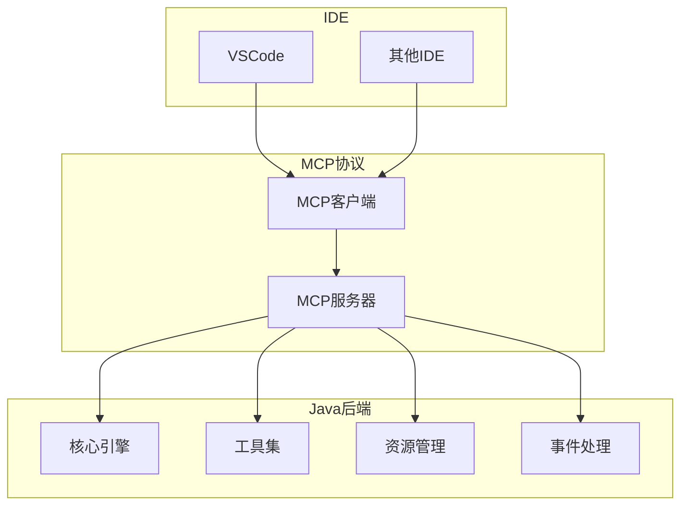

# Midscene Java MCP协议集成方案

## 1. 原项目MCP协议分析

### 1.1 MCP协议概述

原项目 `midscene.js` 支持MCP（Model Context Protocol）协议，实现与IDE的深度集成：<mcreference link="https://juejin.cn/post/7462264897654898715" index="1">1</mcreference>

1. **IDE集成**: 通过MCP协议与VSCode等IDE集成
2. **上下文感知**: 提供代码上下文信息
3. **智能提示**: 基于上下文的智能代码提示
4. **实时反馈**: 提供实时的操作反馈
5. **无缝工作流**: 在IDE内完成UI自动化开发

### 1.2 MCP协议架构

原项目MCP协议采用以下架构：

1. **MCP服务器**: 处理MCP协议请求
2. **工具定义**: 定义可用的工具和功能
3. **资源管理**: 管理代码资源和上下文
4. **事件处理**: 处理IDE事件和通知

## 2. Java版本MCP协议设计

### 2.1 整体架构



### 2.2 MCP协议规范

基于MCP协议规范，我们将实现以下功能：

1. **工具（Tools）**: 提供可执行的UI自动化工具
2. **资源（Resources）**: 管理代码和配置资源
3. **提示（Prompts）**: 提供代码生成和操作提示
4. **事件（Events）**: 处理IDE事件和状态变化

## 3. MCP服务器实现

### 3.1 MCP服务器基础框架

```java
package com.midscene.mcp;

import com.fasterxml.jackson.databind.JsonNode;
import com.fasterxml.jackson.databind.ObjectMapper;
import com.fasterxml.jackson.databind.node.ArrayNode;
import com.fasterxml.jackson.databind.node.ObjectNode;
import com.midscene.core.agent.Agent;
import com.midscene.core.config.MidsceneConfig;
import com.midscene.mcp.handlers.*;
import com.midscene.mcp.tools.*;
import com.midscene.mcp.resources.*;
import com.midscene.mcp.events.*;
import org.slf4j.Logger;
import org.slf4j.LoggerFactory;

import java.io.IOException;
import java.util.Map;
import java.util.concurrent.ConcurrentHashMap;

/**
 * Midscene MCP服务器
 */
public class MidsceneMCPServer {
    private static final Logger logger = LoggerFactory.getLogger(MidsceneMCPServer.class);
    private static final ObjectMapper objectMapper = new ObjectMapper();
    
    private final Agent agent;
    private final Map<String, ToolHandler> toolHandlers;
    private final Map<String, ResourceHandler> resourceHandlers;
    private final Map<String, PromptHandler> promptHandlers;
    private final EventManager eventManager;
    
    public MidsceneMCPServer(MidsceneConfig config) {
        this.agent = new Agent(config);
        this.toolHandlers = new ConcurrentHashMap<>();
        this.resourceHandlers = new ConcurrentHashMap<>();
        this.promptHandlers = new ConcurrentHashMap<>();
        this.eventManager = new EventManager();
        
        initializeHandlers();
    }
    
    /**
     * 初始化处理器
     */
    private void initializeHandlers() {
        // 初始化工具处理器
        toolHandlers.put("execute_action", new ExecuteActionToolHandler(agent));
        toolHandlers.put("query_elements", new QueryElementsToolHandler(agent));
        toolHandlers.put("assert_element", new AssertElementToolHandler(agent));
        toolHandlers.put("take_screenshot", new TakeScreenshotToolHandler(agent));
        toolHandlers.put("get_page_info", new GetPageInfoToolHandler(agent));
        
        // 初始化资源处理器
        resourceHandlers.put("script", new ScriptResourceHandler());
        resourceHandlers.put("config", new ConfigResourceHandler());
        resourceHandlers.put("log", new LogResourceHandler());
        
        // 初始化提示处理器
        promptHandlers.put("generate_script", new GenerateScriptPromptHandler());
        promptHandlers.put("debug_script", new DebugScriptPromptHandler());
        promptHandlers.put("optimize_script", new OptimizeScriptPromptHandler());
    }
    
    /**
     * 处理MCP请求
     */
    public String handleRequest(String jsonRequest) {
        try {
            JsonNode request = objectMapper.readTree(jsonRequest);
            String method = request.get("method").asText();
            JsonNode params = request.get("params");
            String id = request.get("id").asText();
            
            ObjectNode response = objectMapper.createObjectNode();
            response.put("jsonrpc", "2.0");
            response.put("id", id);
            
            switch (method) {
                case "initialize":
                    response.set("result", handleInitialize(params));
                    break;
                    
                case "tools/list":
                    response.set("result", handleListTools());
                    break;
                    
                case "tools/call":
                    response.set("result", handleCallTool(params));
                    break;
                    
                case "resources/list":
                    response.set("result", handleListResources());
                    break;
                    
                case "resources/read":
                    response.set("result", handleReadResource(params));
                    break;
                    
                case "prompts/list":
                    response.set("result", handleListPrompts());
                    break;
                    
                case "prompts/get":
                    response.set("result", handleGetPrompt(params));
                    break;
                    
                default:
                    ObjectNode error = objectMapper.createObjectNode();
                    error.put("code", -32601);
                    error.put("message", "Method not found");
                    response.set("error", error);
            }
            
            return objectMapper.writeValueAsString(response);
        } catch (Exception e) {
            logger.error("Error handling MCP request", e);
            
            try {
                ObjectNode response = objectMapper.createObjectNode();
                response.put("jsonrpc", "2.0");
                
                ObjectNode error = objectMapper.createObjectNode();
                error.put("code", -32603);
                error.put("message", "Internal error: " + e.getMessage());
                response.set("error", error);
                
                return objectMapper.writeValueAsString(response);
            } catch (IOException ex) {
                return "{\"jsonrpc\":\"2.0\",\"error\":{\"code\":-32603,\"message\":\"Internal error\"}}";
            }
        }
    }
    
    /**
     * 处理初始化请求
     */
    private JsonNode handleInitialize(JsonNode params) {
        ObjectNode result = objectMapper.createObjectNode();
        
        result.put("protocolVersion", "2024-11-05");
        result.put("capabilities", createCapabilities());
        result.put("serverInfo", createServerInfo());
        
        return result;
    }
    
    /**
     * 创建服务器能力
     */
    private JsonNode createCapabilities() {
        ObjectNode capabilities = objectMapper.createObjectNode();
        
        // 工具能力
        ObjectNode tools = objectMapper.createObjectNode();
        tools.put("listChanged", true);
        capabilities.set("tools", tools);
        
        // 资源能力
        ObjectNode resources = objectMapper.createObjectNode();
        resources.put("subscribe", true);
        resources.put("listChanged", true);
        capabilities.set("resources", resources);
        
        // 提示能力
        ObjectNode prompts = objectMapper.createObjectNode();
        prompts.put("listChanged", true);
        capabilities.set("prompts", prompts);
        
        // 日志能力
        ObjectNode logging = objectMapper.createObjectNode();
        logging.put("level", "info");
        capabilities.set("logging", logging);
        
        return capabilities;
    }
    
    /**
     * 创建服务器信息
     */
    private JsonNode createServerInfo() {
        ObjectNode serverInfo = objectMapper.createObjectNode();
        serverInfo.put("name", "midscene-java");
        serverInfo.put("version", "1.0.0");
        
        return serverInfo;
    }
    
    /**
     * 处理工具列表请求
     */
    private JsonNode handleListTools() {
        ArrayNode tools = objectMapper.createArrayNode();
        
        for (Map.Entry<String, ToolHandler> entry : toolHandlers.entrySet()) {
            tools.add(entry.getValue().getToolDefinition());
        }
        
        ObjectNode result = objectMapper.createObjectNode();
        result.set("tools", tools);
        
        return result;
    }
    
    /**
     * 处理工具调用请求
     */
    private JsonNode handleCallTool(JsonNode params) {
        String name = params.get("name").asText();
        JsonNode arguments = params.get("arguments");
        
        ToolHandler handler = toolHandlers.get(name);
        if (handler == null) {
            ObjectNode error = objectMapper.createObjectNode();
            error.put("code", -32601);
            error.put("message", "Tool not found: " + name);
            return error;
        }
        
        try {
            return handler.handle(arguments);
        } catch (Exception e) {
            logger.error("Error calling tool: " + name, e);
            
            ObjectNode error = objectMapper.createObjectNode();
            error.put("code", -32603);
            error.put("message", "Tool execution error: " + e.getMessage());
            return error;
        }
    }
    
    /**
     * 处理资源列表请求
     */
    private JsonNode handleListResources() {
        ArrayNode resources = objectMapper.createArrayNode();
        
        for (Map.Entry<String, ResourceHandler> entry : resourceHandlers.entrySet()) {
            resources.add(entry.getValue().getResourceDefinition());
        }
        
        ObjectNode result = objectMapper.createObjectNode();
        result.set("resources", resources);
        
        return result;
    }
    
    /**
     * 处理资源读取请求
     */
    private JsonNode handleReadResource(JsonNode params) {
        String uri = params.get("uri").asText();
        
        // 解析URI获取资源类型和ID
        String[] parts = uri.split("://");
        if (parts.length != 2) {
            ObjectNode error = objectMapper.createObjectNode();
            error.put("code", -32602);
            error.put("message", "Invalid resource URI: " + uri);
            return error;
        }
        
        String resourceType = parts[0];
        String resourceId = parts[1];
        
        ResourceHandler handler = resourceHandlers.get(resourceType);
        if (handler == null) {
            ObjectNode error = objectMapper.createObjectNode();
            error.put("code", -32601);
            error.put("message", "Resource not found: " + resourceType);
            return error;
        }
        
        try {
            return handler.handle(resourceId);
        } catch (Exception e) {
            logger.error("Error reading resource: " + uri, e);
            
            ObjectNode error = objectMapper.createObjectNode();
            error.put("code", -32603);
            error.put("message", "Resource read error: " + e.getMessage());
            return error;
        }
    }
    
    /**
     * 处理提示列表请求
     */
    private JsonNode handleListPrompts() {
        ArrayNode prompts = objectMapper.createArrayNode();
        
        for (Map.Entry<String, PromptHandler> entry : promptHandlers.entrySet()) {
            prompts.add(entry.getValue().getPromptDefinition());
        }
        
        ObjectNode result = objectMapper.createObjectNode();
        result.set("prompts", prompts);
        
        return result;
    }
    
    /**
     * 处理提示获取请求
     */
    private JsonNode handleGetPrompt(JsonNode params) {
        String name = params.get("name").asText();
        JsonNode arguments = params.get("arguments");
        
        PromptHandler handler = promptHandlers.get(name);
        if (handler == null) {
            ObjectNode error = objectMapper.createObjectNode();
            error.put("code", -32601);
            error.put("message", "Prompt not found: " + name);
            return error;
        }
        
        try {
            return handler.handle(arguments);
        } catch (Exception e) {
            logger.error("Error getting prompt: " + name, e);
            
            ObjectNode error = objectMapper.createObjectNode();
            error.put("code", -32603);
            error.put("message", "Prompt get error: " + e.getMessage());
            return error;
        }
    }
    
    /**
     * 关闭服务器
     */
    public void close() {
        if (agent != null) {
            agent.close();
        }
        
        if (eventManager != null) {
            eventManager.close();
        }
    }
}
```

### 3.2 工具处理器

```java
package com.midscene.mcp.tools;

import com.fasterxml.jackson.databind.JsonNode;
import com.fasterxml.jackson.databind.node.ObjectNode;
import com.midscene.core.agent.Agent;
import com.midscene.core.model.ActionRequest;
import com.midscene.core.model.ActionResponse;
import com.midscene.mcp.handlers.ToolHandler;
import com.midscene.mcp.utils.JsonUtils;

/**
 * 执行操作工具处理器
 */
public class ExecuteActionToolHandler implements ToolHandler {
    private final Agent agent;
    
    public ExecuteActionToolHandler(Agent agent) {
        this.agent = agent;
    }
    
    @Override
    public JsonNode getToolDefinition() {
        ObjectNode tool = JsonUtils.createObjectNode();
        
        tool.put("name", "execute_action");
        tool.put("description", "执行UI自动化操作，如点击、输入、选择等");
        
        ObjectNode inputSchema = JsonUtils.createObjectNode();
        inputSchema.put("type", "object");
        
        ObjectNode properties = JsonUtils.createObjectNode();
        
        ObjectNode instructionProp = JsonUtils.createObjectNode();
        instructionProp.put("type", "string");
        instructionProp.put("description", "操作的自然语言描述，如'点击登录按钮'");
        properties.set("instruction", instructionProp);
        
        ObjectNode parametersProp = JsonUtils.createObjectNode();
        parametersProp.put("type", "object");
        parametersProp.put("description", "操作参数，如输入的文本、选择项等");
        properties.set("parameters", parametersProp);
        
        inputSchema.set("properties", properties);
        inputSchema.set("required", JsonUtils.createArrayNode().add("instruction"));
        
        tool.set("inputSchema", inputSchema);
        
        return tool;
    }
    
    @Override
    public JsonNode handle(JsonNode arguments) throws Exception {
        String instruction = arguments.get("instruction").asText();
        JsonNode parametersNode = arguments.get("parameters");
        
        ActionRequest request = new ActionRequest();
        request.setInstruction(instruction);
        
        if (parametersNode != null && !parametersNode.isNull()) {
            request.setParameters(JsonUtils.jsonNodeToMap(parametersNode));
        }
        
        ActionResponse response = agent.aiAction(request);
        
        ObjectNode result = JsonUtils.createObjectNode();
        result.put("success", response.isSuccess());
        result.set("data", JsonUtils.objectToJsonNode(response.getData()));
        
        if (response.getMessage() != null) {
            result.put("message", response.getMessage());
        }
        
        if (response.getError() != null) {
            result.put("error", response.getError());
        }
        
        ObjectNode content = JsonUtils.createObjectNode();
        content.put("type", "text");
        content.put("text", result.toString());
        
        ObjectNode toolResult = JsonUtils.createObjectNode();
        toolResult.set("content", JsonUtils.createArrayNode().add(content));
        
        return toolResult;
    }
}
```

```java
package com.midscene.mcp.tools;

import com.fasterxml.jackson.databind.JsonNode;
import com.fasterxml.jackson.databind.node.ObjectNode;
import com.midscene.core.agent.Agent;
import com.midscene.core.model.QueryRequest;
import com.midscene.core.model.QueryResponse;
import com.midscene.mcp.handlers.ToolHandler;
import com.midscene.mcp.utils.JsonUtils;

/**
 * 查询元素工具处理器
 */
public class QueryElementsToolHandler implements ToolHandler {
    private final Agent agent;
    
    public QueryElementsToolHandler(Agent agent) {
        this.agent = agent;
    }
    
    @Override
    public JsonNode getToolDefinition() {
        ObjectNode tool = JsonUtils.createObjectNode();
        
        tool.put("name", "query_elements");
        tool.put("description", "查询页面元素，获取元素信息或属性");
        
        ObjectNode inputSchema = JsonUtils.createObjectNode();
        inputSchema.put("type", "object");
        
        ObjectNode properties = JsonUtils.createObjectNode();
        
        ObjectNode queryProp = JsonUtils.createObjectNode();
        queryProp.put("type", "string");
        queryProp.put("description", "元素查询的自然语言描述，如'查找登录按钮'");
        properties.set("query", queryProp);
        
        ObjectNode parametersProp = JsonUtils.createObjectNode();
        parametersProp.put("type", "object");
        parametersProp.put("description", "查询参数，如属性名、索引等");
        properties.set("parameters", parametersProp);
        
        inputSchema.set("properties", properties);
        inputSchema.set("required", JsonUtils.createArrayNode().add("query"));
        
        tool.set("inputSchema", inputSchema);
        
        return tool;
    }
    
    @Override
    public JsonNode handle(JsonNode arguments) throws Exception {
        String query = arguments.get("query").asText();
        JsonNode parametersNode = arguments.get("parameters");
        
        QueryRequest request = new QueryRequest();
        request.setQuery(query);
        
        if (parametersNode != null && !parametersNode.isNull()) {
            request.setParameters(JsonUtils.jsonNodeToMap(parametersNode));
        }
        
        QueryResponse response = agent.aiQuery(request);
        
        ObjectNode result = JsonUtils.createObjectNode();
        result.put("success", response.isSuccess());
        result.set("data", JsonUtils.objectToJsonNode(response.getData()));
        
        if (response.getMessage() != null) {
            result.put("message", response.getMessage());
        }
        
        if (response.getError() != null) {
            result.put("error", response.getError());
        }
        
        ObjectNode content = JsonUtils.createObjectNode();
        content.put("type", "text");
        content.put("text", result.toString());
        
        ObjectNode toolResult = JsonUtils.createObjectNode();
        toolResult.set("content", JsonUtils.createArrayNode().add(content));
        
        return toolResult;
    }
}
```

### 3.3 资源处理器

```java
package com.midscene.mcp.resources;

import com.fasterxml.jackson.databind.JsonNode;
import com.fasterxml.jackson.databind.node.ObjectNode;
import com.midscene.mcp.handlers.ResourceHandler;
import com.midscene.mcp.utils.JsonUtils;

/**
 * 脚本资源处理器
 */
public class ScriptResourceHandler implements ResourceHandler {
    
    @Override
    public JsonNode getResourceDefinition() {
        ObjectNode resource = JsonUtils.createObjectNode();
        
        resource.put("uri", "script://");
        resource.put("name", "Midscene脚本");
        resource.put("description", "Midscene UI自动化脚本");
        resource.put("mimeType", "text/plain");
        
        return resource;
    }
    
    @Override
    public JsonNode handle(String resourceId) throws Exception {
        // 根据resourceId获取脚本内容
        String scriptContent = getScriptContent(resourceId);
        
        ObjectNode result = JsonUtils.createObjectNode();
        result.put("contents", scriptContent);
        
        return result;
    }
    
    /**
     * 获取脚本内容
     */
    private String getScriptContent(String resourceId) throws Exception {
        // 这里实现从文件系统或数据库获取脚本内容的逻辑
        // 暂时返回示例脚本
        return """
            import com.midscene.core.agent.Agent;
            
            public class ExampleScript {
                public static void main(String[] args) {
                    Agent agent = new Agent();
                    
                    try {
                        // 打开网页
                        agent.aiAction("打开 https://example.com");
                        
                        // 点击登录按钮
                        agent.aiAction("点击登录按钮");
                        
                        // 输入用户名
                        agent.aiAction("在用户名输入框中输入 testuser");
                        
                        // 输入密码
                        agent.aiAction("在密码输入框中输入 password");
                        
                        // 提交表单
                        agent.aiAction("点击登录按钮");
                        
                        // 验证登录成功
                        agent.aiAssert("页面应该显示欢迎信息");
                    } catch (Exception e) {
                        e.printStackTrace();
                    } finally {
                        agent.close();
                    }
                }
            }
            """;
    }
}
```

### 3.4 提示处理器

```java
package com.midscene.mcp.prompts;

import com.fasterxml.jackson.databind.JsonNode;
import com.fasterxml.jackson.databind.node.ArrayNode;
import com.fasterxml.jackson.databind.node.ObjectNode;
import com.midscene.mcp.handlers.PromptHandler;
import com.midscene.mcp.utils.JsonUtils;

/**
 * 生成脚本提示处理器
 */
public class GenerateScriptPromptHandler implements PromptHandler {
    
    @Override
    public JsonNode getPromptDefinition() {
        ObjectNode prompt = JsonUtils.createObjectNode();
        
        prompt.put("name", "generate_script");
        prompt.put("description", "生成Midscene UI自动化脚本");
        
        ObjectNode arguments = JsonUtils.createObjectNode();
        
        ObjectNode descriptionProp = JsonUtils.createObjectNode();
        descriptionProp.put("type", "string");
        descriptionProp.put("description", "要自动化的操作描述");
        arguments.set("description", descriptionProp);
        
        ObjectNode urlProp = JsonUtils.createObjectNode();
        urlProp.put("type", "string");
        urlProp.put("description", "目标网页URL");
        arguments.set("url", urlProp);
        
        prompt.set("arguments", arguments);
        
        return prompt;
    }
    
    @Override
    public JsonNode handle(JsonNode arguments) throws Exception {
        String description = arguments.get("description").asText();
        String url = arguments.has("url") ? arguments.get("url").asText() : "";
        
        // 生成提示内容
        String promptContent = generatePromptContent(description, url);
        
        ObjectNode result = JsonUtils.createObjectNode();
        
        ObjectNode message = JsonUtils.createObjectNode();
        message.put("role", "user");
        message.put("content", promptContent);
        
        ArrayNode messages = JsonUtils.createArrayNode();
        messages.add(message);
        
        result.set("messages", messages);
        
        return result;
    }
    
    /**
     * 生成提示内容
     */
    private String generatePromptContent(String description, String url) {
        StringBuilder prompt = new StringBuilder();
        prompt.append("请为以下UI自动化场景生成Midscene Java脚本：\n\n");
        prompt.append("操作描述：").append(description).append("\n");
        
        if (!url.isEmpty()) {
            prompt.append("目标网页：").append(url).append("\n");
        }
        
        prompt.append("\n要求：\n");
        prompt.append("1. 使用com.midscene.core.agent.Agent类\n");
        prompt.append("2. 使用aiAction方法执行操作\n");
        prompt.append("3. 使用aiAssert方法进行断言\n");
        prompt.append("4. 包含适当的错误处理\n");
        prompt.append("5. 在finally块中关闭Agent\n");
        
        return prompt.toString();
    }
}
```

### 3.5 事件管理器

```java
package com.midscene.mcp.events;

import com.fasterxml.jackson.databind.JsonNode;
import com.fasterxml.jackson.databind.node.ObjectNode;
import com.midscene.mcp.utils.JsonUtils;
import org.slf4j.Logger;
import org.slf4j.LoggerFactory;

import java.util.Map;
import java.util.concurrent.ConcurrentHashMap;
import java.util.concurrent.CopyOnWriteArrayList;

/**
 * 事件管理器
 */
public class EventManager {
    private static final Logger logger = LoggerFactory.getLogger(EventManager.class);
    
    private final Map<String, CopyOnWriteArrayList<EventListener>> listeners;
    private final Thread eventThread;
    private volatile boolean running;
    
    public EventManager() {
        this.listeners = new ConcurrentHashMap<>();
        this.running = true;
        this.eventThread = new Thread(this::eventLoop);
        this.eventThread.setDaemon(true);
        this.eventThread.start();
    }
    
    /**
     * 注册事件监听器
     */
    public void addListener(String eventType, EventListener listener) {
        listeners.computeIfAbsent(eventType, k -> new CopyOnWriteArrayList<>()).add(listener);
    }
    
    /**
     * 移除事件监听器
     */
    public void removeListener(String eventType, EventListener listener) {
        CopyOnWriteArrayList<EventListener> eventListeners = listeners.get(eventType);
        if (eventListeners != null) {
            eventListeners.remove(listener);
        }
    }
    
    /**
     * 发布事件
     */
    public void publishEvent(String eventType, JsonNode eventData) {
        Event event = new Event(eventType, eventData);
        // 这里简化处理，直接处理事件
        processEvent(event);
    }
    
    /**
     * 事件循环
     */
    private void eventLoop() {
        while (running) {
            try {
                Thread.sleep(100);
            } catch (InterruptedException e) {
                if (!running) {
                    break;
                }
            }
        }
    }
    
    /**
     * 处理事件
     */
    private void processEvent(Event event) {
        CopyOnWriteArrayList<EventListener> eventListeners = listeners.get(event.getType());
        if (eventListeners != null) {
            for (EventListener listener : eventListeners) {
                try {
                    listener.onEvent(event);
                } catch (Exception e) {
                    logger.error("Error handling event: " + event.getType(), e);
                }
            }
        }
    }
    
    /**
     * 关闭事件管理器
     */
    public void close() {
        running = false;
        if (eventThread != null) {
            eventThread.interrupt();
        }
    }
    
    /**
     * 事件类
     */
    public static class Event {
        private final String type;
        private final JsonNode data;
        private final long timestamp;
        
        public Event(String type, JsonNode data) {
            this.type = type;
            this.data = data;
            this.timestamp = System.currentTimeMillis();
        }
        
        public String getType() {
            return type;
        }
        
        public JsonNode getData() {
            return data;
        }
        
        public long getTimestamp() {
            return timestamp;
        }
    }
    
    /**
     * 事件监听器接口
     */
    public interface EventListener {
        void onEvent(Event event);
    }
}
```

## 4. MCP客户端实现

### 4.1 MCP客户端基础框架

```java
package com.midscene.mcp.client;

import com.fasterxml.jackson.databind.JsonNode;
import com.fasterxml.jackson.databind.ObjectMapper;
import com.fasterxml.jackson.databind.node.ObjectNode;
import org.slf4j.Logger;
import org.slf4j.LoggerFactory;

import java.io.*;
import java.net.Socket;
import java.util.concurrent.CompletableFuture;
import java.util.concurrent.ConcurrentHashMap;
import java.util.concurrent.atomic.AtomicLong;

/**
 * Midscene MCP客户端
 */
public class MidsceneMCPClient {
    private static final Logger logger = LoggerFactory.getLogger(MidsceneMCPClient.class);
    private static final ObjectMapper objectMapper = new ObjectMapper();
    
    private final String serverHost;
    private final int serverPort;
    private Socket socket;
    private BufferedReader reader;
    private PrintWriter writer;
    private final AtomicLong requestId;
    private final ConcurrentHashMap<Long, CompletableFuture<JsonNode>> pendingRequests;
    private Thread receiverThread;
    private volatile boolean connected;
    
    public MidsceneMCPClient(String serverHost, int serverPort) {
        this.serverHost = serverHost;
        this.serverPort = serverPort;
        this.requestId = new AtomicLong(1);
        this.pendingRequests = new ConcurrentHashMap<>();
    }
    
    /**
     * 连接到MCP服务器
     */
    public void connect() throws IOException {
        socket = new Socket(serverHost, serverPort);
        reader = new BufferedReader(new InputStreamReader(socket.getInputStream()));
        writer = new PrintWriter(socket.getOutputStream(), true);
        
        connected = true;
        
        // 启动接收线程
        receiverThread = new Thread(this::receiveLoop);
        receiverThread.setDaemon(true);
        receiverThread.start();
        
        // 发送初始化请求
        initialize();
        
        logger.info("Connected to MCP server: {}:{}", serverHost, serverPort);
    }
    
    /**
     * 断开连接
     */
    public void disconnect() {
        connected = false;
        
        if (receiverThread != null) {
            receiverThread.interrupt();
        }
        
        try {
            if (writer != null) {
                writer.close();
            }
            if (reader != null) {
                reader.close();
            }
            if (socket != null) {
                socket.close();
            }
        } catch (IOException e) {
            logger.error("Error closing connection", e);
        }
        
        logger.info("Disconnected from MCP server");
    }
    
    /**
     * 初始化
     */
    private void initialize() throws IOException {
        ObjectNode request = createRequest("initialize");
        ObjectNode params = objectMapper.createObjectNode();
        params.put("protocolVersion", "2024-11-05");
        
        ObjectNode capabilities = objectMapper.createObjectNode();
        ObjectNode sampling = objectMapper.createObjectNode();
        sampling.put("", "");
        capabilities.set("sampling", sampling);
        
        params.set("capabilities", capabilities);
        request.set("params", params);
        
        JsonNode response = sendRequest(request);
        if (response.has("error")) {
            throw new IOException("Initialization failed: " + response.get("error"));
        }
    }
    
    /**
     * 调用工具
     */
    public JsonNode callTool(String name, JsonNode arguments) throws IOException {
        ObjectNode request = createRequest("tools/call");
        ObjectNode params = objectMapper.createObjectNode();
        params.put("name", name);
        params.set("arguments", arguments);
        request.set("params", params);
        
        JsonNode response = sendRequest(request);
        if (response.has("error")) {
            throw new IOException("Tool call failed: " + response.get("error"));
        }
        
        return response.get("result");
    }
    
    /**
     * 读取资源
     */
    public JsonNode readResource(String uri) throws IOException {
        ObjectNode request = createRequest("resources/read");
        ObjectNode params = objectMapper.createObjectNode();
        params.put("uri", uri);
        request.set("params", params);
        
        JsonNode response = sendRequest(request);
        if (response.has("error")) {
            throw new IOException("Resource read failed: " + response.get("error"));
        }
        
        return response.get("result");
    }
    
    /**
     * 获取提示
     */
    public JsonNode getPrompt(String name, JsonNode arguments) throws IOException {
        ObjectNode request = createRequest("prompts/get");
        ObjectNode params = objectMapper.createObjectNode();
        params.put("name", name);
        params.set("arguments", arguments);
        request.set("params", params);
        
        JsonNode response = sendRequest(request);
        if (response.has("error")) {
            throw new IOException("Prompt get failed: " + response.get("error"));
        }
        
        return response.get("result");
    }
    
    /**
     * 创建请求
     */
    private ObjectNode createRequest(String method) {
        ObjectNode request = objectMapper.createObjectNode();
        request.put("jsonrpc", "2.0");
        request.put("method", method);
        request.put("id", requestId.getAndIncrement());
        
        return request;
    }
    
    /**
     * 发送请求
     */
    private JsonNode sendRequest(ObjectNode request) throws IOException {
        if (!connected) {
            throw new IOException("Not connected to server");
        }
        
        long id = request.get("id").asLong();
        CompletableFuture<JsonNode> future = new CompletableFuture<>();
        pendingRequests.put(id, future);
        
        String requestStr = objectMapper.writeValueAsString(request);
        writer.println(requestStr);
        writer.flush();
        
        try {
            return future.get();
        } catch (Exception e) {
            throw new IOException("Request failed", e);
        } finally {
            pendingRequests.remove(id);
        }
    }
    
    /**
     * 接收循环
     */
    private void receiveLoop() {
        try {
            String line;
            while (connected && (line = reader.readLine()) != null) {
                try {
                    JsonNode response = objectMapper.readTree(line);
                    handleResponse(response);
                } catch (Exception e) {
                    logger.error("Error parsing response", e);
                }
            }
        } catch (IOException e) {
            if (connected) {
                logger.error("Error in receive loop", e);
            }
        }
    }
    
    /**
     * 处理响应
     */
    private void handleResponse(JsonNode response) {
        if (response.has("id")) {
            long id = response.get("id").asLong();
            CompletableFuture<JsonNode> future = pendingRequests.get(id);
            if (future != null) {
                future.complete(response);
            }
        } else if (response.has("method")) {
            // 处理通知
            String method = response.get("method").asText();
            JsonNode params = response.get("params");
            handleNotification(method, params);
        }
    }
    
    /**
     * 处理通知
     */
    private void handleNotification(String method, JsonNode params) {
        logger.debug("Received notification: {} with params: {}", method, params);
        // 这里可以添加通知处理逻辑
    }
}
```

## 5. IDE集成示例

### 5.1 VSCode扩展

```javascript
// VSCode扩展主文件
const vscode = require('vscode');
const { MidsceneMCPClient } = require('./mcp-client');

let mcpClient;

function activate(context) {
    // 初始化MCP客户端
    mcpClient = new MidsceneMCPClient('localhost', 8080);
    
    // 注册命令
    let executeActionCommand = vscode.commands.registerCommand('midscene.executeAction', async () => {
        try {
            // 获取用户输入
            const instruction = await vscode.window.showInputBox({
                prompt: '输入UI操作指令',
                placeHolder: '例如：点击登录按钮'
            });
            
            if (!instruction) {
                return;
            }
            
            // 调用MCP工具
            const result = await mcpClient.callTool('execute_action', {
                instruction: instruction
            });
            
            // 显示结果
            vscode.window.showInformationMessage(`操作执行成功: ${result.message}`);
        } catch (error) {
            vscode.window.showErrorMessage(`操作执行失败: ${error.message}`);
        }
    });
    
    let generateScriptCommand = vscode.commands.registerCommand('midscene.generateScript', async () => {
        try {
            // 获取用户输入
            const description = await vscode.window.showInputBox({
                prompt: '输入要自动化的操作描述',
                placeHolder: '例如：登录到网站并检查用户信息'
            });
            
            if (!description) {
                return;
            }
            
            // 调用MCP提示
            const prompt = await mcpClient.getPrompt('generate_script', {
                description: description
            });
            
            // 创建新文档并插入生成的脚本
            const document = await vscode.workspace.openTextDocument({
                content: prompt.messages[0].content,
                language: 'java'
            });
            
            vscode.window.showTextDocument(document);
        } catch (error) {
            vscode.window.showErrorMessage(`脚本生成失败: ${error.message}`);
        }
    });
    
    context.subscriptions.push(executeActionCommand, generateScriptCommand);
}

function deactivate() {
    if (mcpClient) {
        mcpClient.disconnect();
    }
}

module.exports = {
    activate,
    deactivate
};
```

## 6. 实施计划

### 6.1 第一阶段：MCP服务器基础框架 (1周)

1. 实现MCP服务器基础框架
2. 实现JSON-RPC 2.0协议处理
3. 实现工具、资源、提示的基础接口
4. 实现事件管理器

### 6.2 第二阶段：工具实现 (1周)

1. 实现执行操作工具
2. 实现查询元素工具
3. 实现断言元素工具
4. 实现截图工具
5. 实现页面信息工具

### 6.3 第三阶段：资源和提示实现 (1周)

1. 实现脚本资源处理器
2. 实现配置资源处理器
3. 实现日志资源处理器
4. 实现生成脚本提示处理器
5. 实现调试脚本提示处理器
6. 实现优化脚本提示处理器

### 6.4 第四阶段：MCP客户端实现 (1周)

1. 实现MCP客户端基础框架
2. 实现JSON-RPC 2.0协议处理
3. 实现工具调用功能
4. 实现资源读取功能
5. 实现提示获取功能

### 6.5 第五阶段：IDE集成 (1周)

1. 实现VSCode扩展
2. 实现命令注册和处理
3. 实现UI交互
4. 实现错误处理和用户反馈

## 7. 总结

通过本方案，我们将为Midscene Java项目实现与原项目相同的MCP协议功能，实现与IDE的深度集成。这将使用户能够在IDE内直接使用Midscene的功能，包括执行UI操作、查询元素、生成脚本等，大大提高开发效率和工作体验。