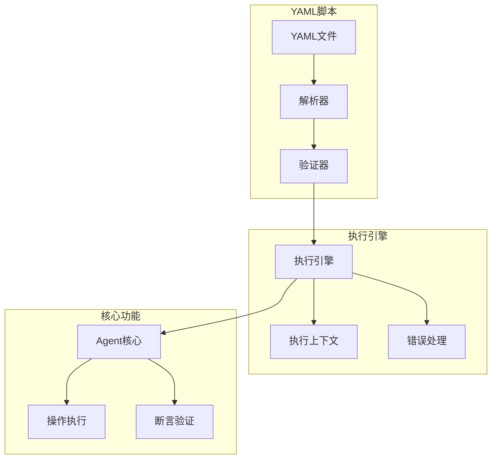

# Midscene Java YAML脚本支持方案

## 1. 原项目YAML脚本分析

### 1.1 YAML脚本概述

原项目 `midscene.js` 支持YAML脚本自动化，提供声明式的UI自动化描述：<mcreference link="https://juejin.cn/post/7462264897654898715" index="1">1</mcreference>

1. **声明式描述**: 使用YAML格式描述UI自动化流程
2. **自然语言集成**: 支持在YAML中使用自然语言描述操作
3. **步骤执行**: 按顺序执行YAML中定义的步骤
4. **条件分支**: 支持条件判断和分支执行
5. **循环控制**: 支持循环执行和迭代

### 1.2 YAML脚本结构

原项目YAML脚本采用以下结构：

```yaml
# 示例YAML脚本
name: "登录流程测试"
description: "测试用户登录功能"
steps:
  - action: "打开 https://example.com"
  - action: "点击登录按钮"
  - action: "在用户名输入框中输入 testuser"
  - action: "在密码输入框中输入 password"
  - action: "点击登录按钮"
  - assert: "页面应该显示欢迎信息"
```

## 2. Java版本YAML脚本设计

### 2.1 整体架构



### 2.2 YAML脚本规范

基于原项目YAML脚本规范，我们将实现以下功能：

1. **元数据**: 脚本名称、描述、版本等
2. **变量定义**: 支持变量定义和引用
3. **步骤定义**: 操作步骤、断言步骤、控制步骤
4. **条件分支**: if-else条件判断
5. **循环控制**: for、while循环
6. **错误处理**: try-catch错误处理
7. **钩子函数**: before、after钩子

## 3. YAML脚本解析器实现

### 3.1 YAML脚本模型

```java
package com.midscene.yaml.model;

import com.fasterxml.jackson.annotation.JsonProperty;
import java.util.List;
import java.util.Map;

/**
 * YAML脚本模型
 */
public class YamlScript {
    @JsonProperty("name")
    private String name;
    
    @JsonProperty("description")
    private String description;
    
    @JsonProperty("version")
    private String version;
    
    @JsonProperty("variables")
    private Map<String, Object> variables;
    
    @JsonProperty("hooks")
    private YamlHooks hooks;
    
    @JsonProperty("steps")
    private List<YamlStep> steps;
    
    // Getters and setters
    public String getName() {
        return name;
    }
    
    public void setName(String name) {
        this.name = name;
    }
    
    public String getDescription() {
        return description;
    }
    
    public void setDescription(String description) {
        this.description = description;
    }
    
    public String getVersion() {
        return version;
    }
    
    public void setVersion(String version) {
        this.version = version;
    }
    
    public Map<String, Object> getVariables() {
        return variables;
    }
    
    public void setVariables(Map<String, Object> variables) {
        this.variables = variables;
    }
    
    public YamlHooks getHooks() {
        return hooks;
    }
    
    public void setHooks(YamlHooks hooks) {
        this.hooks = hooks;
    }
    
    public List<YamlStep> getSteps() {
        return steps;
    }
    
    public void setSteps(List<YamlStep> steps) {
        this.steps = steps;
    }
}
```

```java
package com.midscene.yaml.model;

import com.fasterxml.jackson.annotation.JsonProperty;
import java.util.List;
import java.util.Map;

/**
 * YAML钩子模型
 */
public class YamlHooks {
    @JsonProperty("before")
    private List<YamlStep> before;
    
    @JsonProperty("after")
    private List<YamlStep> after;
    
    @JsonProperty("beforeEach")
    private List<YamlStep> beforeEach;
    
    @JsonProperty("afterEach")
    private List<YamlStep> afterEach;
    
    // Getters and setters
    public List<YamlStep> getBefore() {
        return before;
    }
    
    public void setBefore(List<YamlStep> before) {
        this.before = before;
    }
    
    public List<YamlStep> getAfter() {
        return after;
    }
    
    public void setAfter(List<YamlStep> after) {
        this.after = after;
    }
    
    public List<YamlStep> getBeforeEach() {
        return beforeEach;
    }
    
    public void setBeforeEach(List<YamlStep> beforeEach) {
        this.beforeEach = beforeEach;
    }
    
    public List<YamlStep> getAfterEach() {
        return afterEach;
    }
    
    public void setAfterEach(List<YamlStep> afterEach) {
        this.afterEach = afterEach;
    }
}
```

```java
package com.midscene.yaml.model;

import com.fasterxml.jackson.annotation.JsonProperty;
import java.util.Map;

/**
 * YAML步骤模型
 */
public class YamlStep {
    @JsonProperty("action")
    private String action;
    
    @JsonProperty("assert")
    private String assertStatement;
    
    @JsonProperty("query")
    private String query;
    
    @JsonProperty("if")
    private YamlCondition ifCondition;
    
    @JsonProperty("else")
    private List<YamlStep> elseSteps;
    
    @JsonProperty("for")
    private YamlLoop forLoop;
    
    @JsonProperty("while")
    private YamlLoop whileLoop;
    
    @JsonProperty("try")
    private List<YamlStep> trySteps;
    
    @JsonProperty("catch")
    private List<YamlStep> catchSteps;
    
    @JsonProperty("variables")
    private Map<String, Object> variables;
    
    @JsonProperty("description")
    private String description;
    
    @JsonProperty("timeout")
    private Integer timeout;
    
    @JsonProperty("retry")
    private Integer retry;
    
    // Getters and setters
    public String getAction() {
        return action;
    }
    
    public void setAction(String action) {
        this.action = action;
    }
    
    public String getAssertStatement() {
        return assertStatement;
    }
    
    public void setAssertStatement(String assertStatement) {
        this.assertStatement = assertStatement;
    }
    
    public String getQuery() {
        return query;
    }
    
    public void setQuery(String query) {
        this.query = query;
    }
    
    public YamlCondition getIfCondition() {
        return ifCondition;
    }
    
    public void setIfCondition(YamlCondition ifCondition) {
        this.ifCondition = ifCondition;
    }
    
    public List<YamlStep> getElseSteps() {
        return elseSteps;
    }
    
    public void setElseSteps(List<YamlStep> elseSteps) {
        this.elseSteps = elseSteps;
    }
    
    public YamlLoop getForLoop() {
        return forLoop;
    }
    
    public void setForLoop(YamlLoop forLoop) {
        this.forLoop = forLoop;
    }
    
    public YamlLoop getWhileLoop() {
        return whileLoop;
    }
    
    public void setWhileLoop(YamlLoop whileLoop) {
        this.whileLoop = whileLoop;
    }
    
    public List<YamlStep> getTrySteps() {
        return trySteps;
    }
    
    public void setTrySteps(List<YamlStep> trySteps) {
        this.trySteps = trySteps;
    }
    
    public List<YamlStep> getCatchSteps() {
        return catchSteps;
    }
    
    public void setCatchSteps(List<YamlStep> catchSteps) {
        this.catchSteps = catchSteps;
    }
    
    public Map<String, Object> getVariables() {
        return variables;
    }
    
    public void setVariables(Map<String, Object> variables) {
        this.variables = variables;
    }
    
    public String getDescription() {
        return description;
    }
    
    public void setDescription(String description) {
        this.description = description;
    }
    
    public Integer getTimeout() {
        return timeout;
    }
    
    public void setTimeout(Integer timeout) {
        this.timeout = timeout;
    }
    
    public Integer getRetry() {
        return retry;
    }
    
    public void setRetry(Integer retry) {
        this.retry = retry;
    }
}
```

```java
package com.midscene.yaml.model;

import com.fasterxml.jackson.annotation.JsonProperty;

/**
 * YAML条件模型
 */
public class YamlCondition {
    @JsonProperty("expression")
    private String expression;
    
    @JsonProperty("steps")
    private List<YamlStep> steps;
    
    // Getters and setters
    public String getExpression() {
        return expression;
    }
    
    public void setExpression(String expression) {
        this.expression = expression;
    }
    
    public List<YamlStep> getSteps() {
        return steps;
    }
    
    public void setSteps(List<YamlStep> steps) {
        this.steps = steps;
    }
}
```

```java
package com.midscene.yaml.model;

import com.fasterxml.jackson.annotation.JsonProperty;

/**
 * YAML循环模型
 */
public class YamlLoop {
    @JsonProperty("variable")
    private String variable;
    
    @JsonProperty("in")
    private Object in;
    
    @JsonProperty("expression")
    private String expression;
    
    @JsonProperty("steps")
    private List<YamlStep> steps;
    
    // Getters and setters
    public String getVariable() {
        return variable;
    }
    
    public void setVariable(String variable) {
        this.variable = variable;
    }
    
    public Object getIn() {
        return in;
    }
    
    public void setIn(Object in) {
        this.in = in;
    }
    
    public String getExpression() {
        return expression;
    }
    
    public void setExpression(String expression) {
        this.expression = expression;
    }
    
    public List<YamlStep> getSteps() {
        return steps;
    }
    
    public void setSteps(List<YamlStep> steps) {
        this.steps = steps;
    }
}
```

### 3.2 YAML脚本解析器

```java
package com.midscene.yaml.parser;

import com.fasterxml.jackson.databind.ObjectMapper;
import com.fasterxml.jackson.dataformat.yaml.YAMLFactory;
import com.fasterxml.jackson.datatype.jsr310.JavaTimeModule;
import com.midscene.yaml.model.YamlScript;
import com.midscene.yaml.validation.YamlValidator;
import com.midscene.yaml.validation.YamlValidationResult;

import java.io.IOException;
import java.io.InputStream;

/**
 * YAML脚本解析器
 */
public class YamlScriptParser {
    private final ObjectMapper yamlMapper;
    private final YamlValidator validator;
    
    public YamlScriptParser() {
        this.yamlMapper = new ObjectMapper(new YAMLFactory());
        this.yamlMapper.registerModule(new JavaTimeModule());
        this.validator = new YamlValidator();
    }
    
    /**
     * 从文件解析YAML脚本
     */
    public YamlParseResult parseFromFile(String filePath) throws YamlParseException {
        try (InputStream inputStream = getClass().getClassLoader().getResourceAsStream(filePath)) {
            if (inputStream == null) {
                throw new YamlParseException("YAML file not found: " + filePath);
            }
            
            return parseFromStream(inputStream);
        } catch (IOException e) {
            throw new YamlParseException("Failed to read YAML file: " + filePath, e);
        }
    }
    
    /**
     * 从字符串解析YAML脚本
     */
    public YamlParseResult parseFromString(String yamlContent) throws YamlParseException {
        try {
            YamlScript script = yamlMapper.readValue(yamlContent, YamlScript.class);
            
            // 验证脚本
            YamlValidationResult validationResult = validator.validate(script);
            
            return new YamlParseResult(script, validationResult);
        } catch (IOException e) {
            throw new YamlParseException("Failed to parse YAML content", e);
        }
    }
    
    /**
     * 从输入流解析YAML脚本
     */
    public YamlParseResult parseFromStream(InputStream inputStream) throws YamlParseException {
        try {
            YamlScript script = yamlMapper.readValue(inputStream, YamlScript.class);
            
            // 验证脚本
            YamlValidationResult validationResult = validator.validate(script);
            
            return new YamlParseResult(script, validationResult);
        } catch (IOException e) {
            throw new YamlParseException("Failed to parse YAML stream", e);
        }
    }
}
```

```java
package com.midscene.yaml.parser;

import com.midscene.yaml.model.YamlScript;
import com.midscene.yaml.validation.YamlValidationResult;

/**
 * YAML解析结果
 */
public class YamlParseResult {
    private final YamlScript script;
    private final YamlValidationResult validationResult;
    
    public YamlParseResult(YamlScript script, YamlValidationResult validationResult) {
        this.script = script;
        this.validationResult = validationResult;
    }
    
    public YamlScript getScript() {
        return script;
    }
    
    public YamlValidationResult getValidationResult() {
        return validationResult;
    }
    
    public boolean isValid() {
        return validationResult.isValid();
    }
}
```

```java
package com.midscene.yaml.parser;

/**
 * YAML解析异常
 */
public class YamlParseException extends Exception {
    public YamlParseException(String message) {
        super(message);
    }
    
    public YamlParseException(String message, Throwable cause) {
        super(message, cause);
    }
}
```

## 4. YAML脚本验证器实现

```java
package com.midscene.yaml.validation;

import com.midscene.yaml.model.YamlCondition;
import com.midscene.yaml.model.YamlLoop;
import com.midscene.yaml.model.YamlScript;
import com.midscene.yaml.model.YamlStep;

import java.util.ArrayList;
import java.util.List;

/**
 * YAML脚本验证器
 */
public class YamlValidator {
    
    /**
     * 验证YAML脚本
     */
    public YamlValidationResult validate(YamlScript script) {
        List<YamlValidationError> errors = new ArrayList<>();
        List<YamlValidationWarning> warnings = new ArrayList<>();
        
        // 验证脚本基本信息
        validateScriptInfo(script, errors, warnings);
        
        // 验证变量定义
        validateVariables(script, errors, warnings);
        
        // 验证钩子
        validateHooks(script, errors, warnings);
        
        // 验证步骤
        validateSteps(script.getSteps(), errors, warnings);
        
        boolean isValid = errors.isEmpty();
        return new YamlValidationResult(isValid, errors, warnings);
    }
    
    /**
     * 验证脚本基本信息
     */
    private void validateScriptInfo(YamlScript script, List<YamlValidationError> errors, List<YamlValidationWarning> warnings) {
        if (script.getName() == null || script.getName().trim().isEmpty()) {
            errors.add(new YamlValidationError("script.name", "脚本名称不能为空"));
        }
        
        if (script.getSteps() == null || script.getSteps().isEmpty()) {
            errors.add(new YamlValidationError("script.steps", "脚本必须包含至少一个步骤"));
        }
        
        if (script.getVersion() == null) {
            warnings.add(new YamlValidationWarning("script.version", "建议指定脚本版本"));
        }
    }
    
    /**
     * 验证变量定义
     */
    private void validateVariables(YamlScript script, List<YamlValidationError> errors, List<YamlValidationWarning> warnings) {
        if (script.getVariables() != null) {
            for (String varName : script.getVariables().keySet()) {
                if (!isValidVariableName(varName)) {
                    errors.add(new YamlValidationError("variables." + varName, "变量名无效: " + varName));
                }
            }
        }
    }
    
    /**
     * 验证钩子
     */
    private void validateHooks(YamlScript script, List<YamlValidationError> errors, List<YamlValidationWarning> warnings) {
        if (script.getHooks() != null) {
            validateSteps(script.getHooks().getBefore(), errors, warnings, "hooks.before");
            validateSteps(script.getHooks().getAfter(), errors, warnings, "hooks.after");
            validateSteps(script.getHooks().getBeforeEach(), errors, warnings, "hooks.beforeEach");
            validateSteps(script.getHooks().getAfterEach(), errors, warnings, "hooks.afterEach");
        }
    }
    
    /**
     * 验证步骤列表
     */
    private void validateSteps(List<YamlStep> steps, List<YamlValidationError> errors, List<YamlValidationWarning> warnings) {
        validateSteps(steps, errors, warnings, "steps");
    }
    
    /**
     * 验证步骤列表
     */
    private void validateSteps(List<YamlStep> steps, List<YamlValidationError> errors, List<YamlValidationWarning> warnings, String prefix) {
        if (steps == null) {
            return;
        }
        
        for (int i = 0; i < steps.size(); i++) {
            YamlStep step = steps.get(i);
            String stepPrefix = prefix + "[" + i + "]";
            validateStep(step, errors, warnings, stepPrefix);
        }
    }
    
    /**
     * 验证单个步骤
     */
    private void validateStep(YamlStep step, List<YamlValidationError> errors, List<YamlValidationWarning> warnings, String prefix) {
        if (step == null) {
            errors.add(new YamlValidationError(prefix, "步骤不能为空"));
            return;
        }
        
        // 验证步骤类型
        int stepTypeCount = 0;
        if (step.getAction() != null) stepTypeCount++;
        if (step.getAssertStatement() != null) stepTypeCount++;
        if (step.getQuery() != null) stepTypeCount++;
        if (step.getIfCondition() != null) stepTypeCount++;
        if (step.getForLoop() != null) stepTypeCount++;
        if (step.getWhileLoop() != null) stepTypeCount++;
        if (step.getTrySteps() != null) stepTypeCount++;
        
        if (stepTypeCount == 0) {
            errors.add(new YamlValidationError(prefix, "步骤必须指定一种类型: action, assert, query, if, for, while, try"));
        } else if (stepTypeCount > 1) {
            errors.add(new YamlValidationError(prefix, "步骤只能指定一种类型"));
        }
        
        // 验证条件语句
        if (step.getIfCondition() != null) {
            validateCondition(step.getIfCondition(), errors, warnings, prefix + ".if");
        }
        
        // 验证循环语句
        if (step.getForLoop() != null) {
            validateLoop(step.getForLoop(), errors, warnings, prefix + ".for");
        }
        
        if (step.getWhileLoop() != null) {
            validateLoop(step.getWhileLoop(), errors, warnings, prefix + ".while");
        }
        
        // 验证try-catch语句
        if (step.getTrySteps() != null) {
            validateSteps(step.getTrySteps(), errors, warnings, prefix + ".try");
            if (step.getCatchSteps() != null) {
                validateSteps(step.getCatchSteps(), errors, warnings, prefix + ".catch");
            } else {
                warnings.add(new YamlValidationWarning(prefix + ".try", "try块建议添加catch块"));
            }
        }
        
        // 验证变量定义
        if (step.getVariables() != null) {
            for (String varName : step.getVariables().keySet()) {
                if (!isValidVariableName(varName)) {
                    errors.add(new YamlValidationError(prefix + ".variables." + varName, "变量名无效: " + varName));
                }
            }
        }
    }
    
    /**
     * 验证条件语句
     */
    private void validateCondition(YamlCondition condition, List<YamlValidationError> errors, List<YamlValidationWarning> warnings, String prefix) {
        if (condition.getExpression() == null || condition.getExpression().trim().isEmpty()) {
            errors.add(new YamlValidationError(prefix + ".expression", "条件表达式不能为空"));
        }
        
        if (condition.getSteps() == null || condition.getSteps().isEmpty()) {
            errors.add(new YamlValidationError(prefix + ".steps", "条件步骤不能为空"));
        } else {
            validateSteps(condition.getSteps(), errors, warnings, prefix + ".steps");
        }
    }
    
    /**
     * 验证循环语句
     */
    private void validateLoop(YamlLoop loop, List<YamlValidationError> errors, List<YamlValidationWarning> warnings, String prefix) {
        if (loop.getSteps() == null || loop.getSteps().isEmpty()) {
            errors.add(new YamlValidationError(prefix + ".steps", "循环步骤不能为空"));
        } else {
            validateSteps(loop.getSteps(), errors, warnings, prefix + ".steps");
        }
        
        // 验证for循环
        if (loop.getVariable() != null && loop.getIn() == null && loop.getExpression() == null) {
            errors.add(new YamlValidationError(prefix, "for循环必须指定in或expression"));
        }
        
        // 验证while循环
        if (loop.getExpression() != null && loop.getExpression().trim().isEmpty()) {
            errors.add(new YamlValidationError(prefix + ".expression", "while循环表达式不能为空"));
        }
    }
    
    /**
     * 验证变量名是否有效
     */
    private boolean isValidVariableName(String varName) {
        if (varName == null || varName.trim().isEmpty()) {
            return false;
        }
        
        // 变量名只能包含字母、数字和下划线，且不能以数字开头
        return varName.matches("^[a-zA-Z_][a-zA-Z0-9_]*$");
    }
}
```

```java
package com.midscene.yaml.validation;

import java.util.List;

/**
 * YAML验证结果
 */
public class YamlValidationResult {
    private final boolean valid;
    private final List<YamlValidationError> errors;
    private final List<YamlValidationWarning> warnings;
    
    public YamlValidationResult(boolean valid, List<YamlValidationError> errors, List<YamlValidationWarning> warnings) {
        this.valid = valid;
        this.errors = errors;
        this.warnings = warnings;
    }
    
    public boolean isValid() {
        return valid;
    }
    
    public List<YamlValidationError> getErrors() {
        return errors;
    }
    
    public List<YamlValidationWarning> getWarnings() {
        return warnings;
    }
}
```

```java
package com.midscene.yaml.validation;

/**
 * YAML验证错误
 */
public class YamlValidationError {
    private final String path;
    private final String message;
    
    public YamlValidationError(String path, String message) {
        this.path = path;
        this.message = message;
    }
    
    public String getPath() {
        return path;
    }
    
    public String getMessage() {
        return message;
    }
    
    @Override
    public String toString() {
        return path + ": " + message;
    }
}
```

```java
package com.midscene.yaml.validation;

/**
 * YAML验证警告
 */
public class YamlValidationWarning {
    private final String path;
    private final String message;
    
    public YamlValidationWarning(String path, String message) {
        this.path = path;
        this.message = message;
    }
    
    public String getPath() {
        return path;
    }
    
    public String getMessage() {
        return message;
    }
    
    @Override
    public String toString() {
        return path + ": " + message;
    }
}
```

## 5. YAML脚本执行引擎实现

### 5.1 执行引擎基础框架

```java
package com.midscene.yaml.engine;

import com.midscene.core.agent.Agent;
import com.midscene.core.config.MidsceneConfig;
import com.midscene.yaml.model.YamlScript;
import com.midscene.yaml.model.YamlStep;
import com.midscene.yaml.parser.YamlParseException;
import com.midscene.yaml.parser.YamlParseResult;
import com.midscene.yaml.parser.YamlScriptParser;
import org.slf4j.Logger;
import org.slf4j.LoggerFactory;

import java.util.HashMap;
import java.util.Map;

/**
 * YAML脚本执行引擎
 */
public class YamlScriptEngine {
    private static final Logger logger = LoggerFactory.getLogger(YamlScriptEngine.class);
    
    private final Agent agent;
    private final YamlScriptParser parser;
    private final YamlStepExecutor stepExecutor;
    
    public YamlScriptEngine(MidsceneConfig config) {
        this.agent = new Agent(config);
        this.parser = new YamlScriptParser();
        this.stepExecutor = new YamlStepExecutor(agent);
    }
    
    /**
     * 从文件执行YAML脚本
     */
    public YamlExecutionResult executeFromFile(String filePath) throws YamlExecutionException {
        try {
            YamlParseResult parseResult = parser.parseFromFile(filePath);
            return execute(parseResult);
        } catch (YamlParseException e) {
            throw new YamlExecutionException("Failed to parse YAML script: " + filePath, e);
        }
    }
    
    /**
     * 从字符串执行YAML脚本
     */
    public YamlExecutionResult executeFromString(String yamlContent) throws YamlExecutionException {
        try {
            YamlParseResult parseResult = parser.parseFromString(yamlContent);
            return execute(parseResult);
        } catch (YamlParseException e) {
            throw new YamlExecutionException("Failed to parse YAML content", e);
        }
    }
    
    /**
     * 执行YAML脚本
     */
    private YamlExecutionResult execute(YamlParseResult parseResult) throws YamlExecutionException {
        if (!parseResult.isValid()) {
            throw new YamlExecutionException("YAML script validation failed: " + parseResult.getValidationResult().getErrors());
        }
        
        YamlScript script = parseResult.getScript();
        YamlExecutionContext context = new YamlExecutionContext(script);
        
        try {
            // 执行before钩子
            executeHooks(script.getHooks().getBefore(), context);
            
            // 执行主步骤
            for (int i = 0; i < script.getSteps().size(); i++) {
                YamlStep step = script.getSteps().get(i);
                
                // 执行beforeEach钩子
                executeHooks(script.getHooks().getBeforeEach(), context);
                
                try {
                    // 执行步骤
                    stepExecutor.executeStep(step, context);
                    context.addStepResult(i, new YamlStepResult(true, null, null));
                } catch (Exception e) {
                    context.addStepResult(i, new YamlStepResult(false, e.getMessage(), e));
                    
                    // 如果步骤失败且没有重试，则抛出异常
                    if (step.getRetry() == null || step.getRetry() <= 0) {
                        throw new YamlExecutionException("Step execution failed: " + e.getMessage(), e);
                    }
                    
                    // 重试逻辑
                    boolean success = false;
                    for (int retry = 0; retry < step.getRetry(); retry++) {
                        try {
                            stepExecutor.executeStep(step, context);
                            context.addStepResult(i, new YamlStepResult(true, null, null));
                            success = true;
                            break;
                        } catch (Exception retryException) {
                            logger.warn("Step retry failed: {}", retryException.getMessage());
                        }
                    }
                    
                    if (!success) {
                        throw new YamlExecutionException("Step execution failed after retries: " + e.getMessage(), e);
                    }
                }
                
                // 执行afterEach钩子
                executeHooks(script.getHooks().getAfterEach(), context);
            }
            
            // 执行after钩子
            executeHooks(script.getHooks().getAfter(), context);
            
            return new YamlExecutionResult(true, context, null);
        } catch (Exception e) {
            return new YamlExecutionResult(false, context, e);
        } finally {
            // 清理资源
            if (agent != null) {
                agent.close();
            }
        }
    }
    
    /**
     * 执行钩子
     */
    private void executeHooks(List<YamlStep> hooks, YamlExecutionContext context) throws YamlExecutionException {
        if (hooks == null || hooks.isEmpty()) {
            return;
        }
        
        for (YamlStep hook : hooks) {
            stepExecutor.executeStep(hook, context);
        }
    }
}
```

```java
package com.midscene.yaml.engine;

import com.midscene.yaml.model.YamlExecutionContext;
import com.midscene.yaml.model.YamlStepResult;

/**
 * YAML执行结果
 */
public class YamlExecutionResult {
    private final boolean success;
    private final YamlExecutionContext context;
    private final Exception exception;
    
    public YamlExecutionResult(boolean success, YamlExecutionContext context, Exception exception) {
        this.success = success;
        this.context = context;
        this.exception = exception;
    }
    
    public boolean isSuccess() {
        return success;
    }
    
    public YamlExecutionContext getContext() {
        return context;
    }
    
    public Exception getException() {
        return exception;
    }
    
    public Map<Integer, YamlStepResult> getStepResults() {
        return context.getStepResults();
    }
}
```

```java
package com.midscene.yaml.engine;

/**
 * YAML执行异常
 */
public class YamlExecutionException extends Exception {
    public YamlExecutionException(String message) {
        super(message);
    }
    
    public YamlExecutionException(String message, Throwable cause) {
        super(message, cause);
    }
}
```

### 5.2 步骤执行器

```java
package com.midscene.yaml.engine;

import com.midscene.core.agent.Agent;
import com.midscene.core.model.ActionRequest;
import com.midscene.core.model.ActionResponse;
import com.midscene.core.model.AssertRequest;
import com.midscene.core.model.AssertResponse;
import com.midscene.core.model.QueryRequest;
import com.midscene.core.model.QueryResponse;
import com.midscene.yaml.model.YamlCondition;
import com.midscene.yaml.model.YamlExecutionContext;
import com.midscene.yaml.model.YamlLoop;
import com.midscene.yaml.model.YamlStep;
import org.slf4j.Logger;
import org.slf4j.LoggerFactory;

import java.util.List;
import java.util.Map;

/**
 * YAML步骤执行器
 */
public class YamlStepExecutor {
    private static final Logger logger = LoggerFactory.getLogger(YamlStepExecutor.class);
    
    private final Agent agent;
    
    public YamlStepExecutor(Agent agent) {
        this.agent = agent;
    }
    
    /**
     * 执行步骤
     */
    public void executeStep(YamlStep step, YamlExecutionContext context) throws YamlExecutionException {
        // 设置步骤变量
        if (step.getVariables() != null) {
            for (Map.Entry<String, Object> entry : step.getVariables().entrySet()) {
                context.setVariable(entry.getKey(), entry.getValue());
            }
        }
        
        // 根据步骤类型执行
        if (step.getAction() != null) {
            executeAction(step, context);
        } else if (step.getAssertStatement() != null) {
            executeAssert(step, context);
        } else if (step.getQuery() != null) {
            executeQuery(step, context);
        } else if (step.getIfCondition() != null) {
            executeIf(step, context);
        } else if (step.getForLoop() != null) {
            executeForLoop(step, context);
        } else if (step.getWhileLoop() != null) {
            executeWhileLoop(step, context);
        } else if (step.getTrySteps() != null) {
            executeTryCatch(step, context);
        } else {
            throw new YamlExecutionException("Unknown step type");
        }
    }
    
    /**
     * 执行操作
     */
    private void executeAction(YamlStep step, YamlExecutionContext context) throws YamlExecutionException {
        try {
            String instruction = replaceVariables(step.getAction(), context);
            
            ActionRequest request = new ActionRequest();
            request.setInstruction(instruction);
            
            // 设置超时
            if (step.getTimeout() != null) {
                request.setTimeout(step.getTimeout());
            }
            
            ActionResponse response = agent.aiAction(request);
            
            if (!response.isSuccess()) {
                throw new YamlExecutionException("Action failed: " + response.getError());
            }
            
            // 保存结果到上下文
            if (response.getData() != null) {
                context.setLastResult(response.getData());
            }
            
            logger.info("Action executed successfully: {}", instruction);
        } catch (Exception e) {
            throw new YamlExecutionException("Failed to execute action: " + e.getMessage(), e);
        }
    }
    
    /**
     * 执行断言
     */
    private void executeAssert(YamlStep step, YamlExecutionContext context) throws YamlExecutionException {
        try {
            String assertion = replaceVariables(step.getAssertStatement(), context);
            
            AssertRequest request = new AssertRequest();
            request.setAssertion(assertion);
            
            // 设置超时
            if (step.getTimeout() != null) {
                request.setTimeout(step.getTimeout());
            }
            
            AssertResponse response = agent.aiAssert(request);
            
            if (!response.isSuccess()) {
                throw new YamlExecutionException("Assertion failed: " + response.getError());
            }
            
            logger.info("Assertion passed: {}", assertion);
        } catch (Exception e) {
            throw new YamlExecutionException("Failed to execute assertion: " + e.getMessage(), e);
        }
    }
    
    /**
     * 执行查询
     */
    private void executeQuery(YamlStep step, YamlExecutionContext context) throws YamlExecutionException {
        try {
            String query = replaceVariables(step.getQuery(), context);
            
            QueryRequest request = new QueryRequest();
            request.setQuery(query);
            
            // 设置超时
            if (step.getTimeout() != null) {
                request.setTimeout(step.getTimeout());
            }
            
            QueryResponse response = agent.aiQuery(request);
            
            if (!response.isSuccess()) {
                throw new YamlExecutionException("Query failed: " + response.getError());
            }
            
            // 保存结果到上下文
            if (response.getData() != null) {
                context.setLastResult(response.getData());
            }
            
            logger.info("Query executed successfully: {}", query);
        } catch (Exception e) {
            throw new YamlExecutionException("Failed to execute query: " + e.getMessage(), e);
        }
    }
    
    /**
     * 执行条件语句
     */
    private void executeIf(YamlStep step, YamlExecutionContext context) throws YamlExecutionException {
        YamlCondition condition = step.getIfCondition();
        
        try {
            // 评估条件表达式
            boolean conditionResult = evaluateExpression(condition.getExpression(), context);
            
            if (conditionResult) {
                // 执行条件为真的步骤
                for (YamlStep conditionStep : condition.getSteps()) {
                    executeStep(conditionStep, context);
                }
            } else if (step.getElseSteps() != null) {
                // 执行else步骤
                for (YamlStep elseStep : step.getElseSteps()) {
                    executeStep(elseStep, context);
                }
            }
        } catch (Exception e) {
            throw new YamlExecutionException("Failed to execute if condition: " + e.getMessage(), e);
        }
    }
    
    /**
     * 执行for循环
     */
    private void executeForLoop(YamlStep step, YamlExecutionContext context) throws YamlExecutionException {
        YamlLoop loop = step.getForLoop();
        
        try {
            if (loop.getIn() != null) {
                // 遍历集合
                Iterable<?> iterable = toIterable(loop.getIn(), context);
                for (Object item : iterable) {
                    context.setVariable(loop.getVariable(), item);
                    
                    for (YamlStep loopStep : loop.getSteps()) {
                        executeStep(loopStep, context);
                    }
                }
            } else if (loop.getExpression() != null) {
                // 基于表达式循环
                boolean continueLoop = evaluateExpression(loop.getExpression(), context);
                while (continueLoop) {
                    for (YamlStep loopStep : loop.getSteps()) {
                        executeStep(loopStep, context);
                    }
                    
                    continueLoop = evaluateExpression(loop.getExpression(), context);
                }
            }
        } catch (Exception e) {
            throw new YamlExecutionException("Failed to execute for loop: " + e.getMessage(), e);
        }
    }
    
    /**
     * 执行while循环
     */
    private void executeWhileLoop(YamlStep step, YamlExecutionContext context) throws YamlExecutionException {
        YamlLoop loop = step.getWhileLoop();
        
        try {
            boolean continueLoop = evaluateExpression(loop.getExpression(), context);
            while (continueLoop) {
                for (YamlStep loopStep : loop.getSteps()) {
                    executeStep(loopStep, context);
                }
                
                continueLoop = evaluateExpression(loop.getExpression(), context);
            }
        } catch (Exception e) {
            throw new YamlExecutionException("Failed to execute while loop: " + e.getMessage(), e);
        }
    }
    
    /**
     * 执行try-catch语句
     */
    private void executeTryCatch(YamlStep step, YamlExecutionContext context) throws YamlExecutionException {
        try {
            // 执行try块
            for (YamlStep tryStep : step.getTrySteps()) {
                executeStep(tryStep, context);
            }
        } catch (Exception e) {
            if (step.getCatchSteps() != null) {
                // 保存异常信息
                context.setVariable("exception", e);
                
                // 执行catch块
                for (YamlStep catchStep : step.getCatchSteps()) {
                    executeStep(catchStep, context);
                }
            } else {
                // 没有catch块，重新抛出异常
                throw new YamlExecutionException("Exception in try block and no catch block: " + e.getMessage(), e);
            }
        }
    }
    
    /**
     * 替换字符串中的变量
     */
    private String replaceVariables(String text, YamlExecutionContext context) {
        if (text == null) {
            return null;
        }
        
        String result = text;
        
        // 替换变量 ${variableName}
        for (Map.Entry<String, Object> entry : context.getVariables().entrySet()) {
            String varName = entry.getKey();
            Object varValue = entry.getValue();
            
            if (varValue != null) {
                result = result.replace("${" + varName + "}", varValue.toString());
            }
        }
        
        return result;
    }
    
    /**
     * 评估表达式
     */
    private boolean evaluateExpression(String expression, YamlExecutionContext context) {
        // 这里简化处理，实际应该实现一个表达式引擎
        // 暂时只支持简单的变量检查
        
        // 检查变量是否存在且不为空
        if (expression.startsWith("exists(") && expression.endsWith(")")) {
            String varName = expression.substring(7, expression.length() - 1);
            Object value = context.getVariable(varName);
            return value != null;
        }
        
        // 检查变量是否为真
        if (expression.startsWith("isTrue(") && expression.endsWith(")")) {
            String varName = expression.substring(7, expression.length() - 1);
            Object value = context.getVariable(varName);
            if (value instanceof Boolean) {
                return (Boolean) value;
            }
            return false;
        }
        
        // 默认返回false
        return false;
    }
    
    /**
     * 将对象转换为可迭代对象
     */
    @SuppressWarnings("unchecked")
    private Iterable<?> toIterable(Object obj, YamlExecutionContext context) {
        if (obj instanceof Iterable) {
            return (Iterable<?>) obj;
        } else if (obj instanceof Map) {
            return ((Map<?, ?>) obj).entrySet();
        } else if (obj.getClass().isArray()) {
            return java.util.Arrays.asList((Object[]) obj);
        } else {
            // 将单个元素包装为单元素列表
            return java.util.Collections.singletonList(obj);
        }
    }
}
```

### 5.3 执行上下文

```java
package com.midscene.yaml.model;

import java.util.HashMap;
import java.util.Map;

/**
 * YAML执行上下文
 */
public class YamlExecutionContext {
    private final YamlScript script;
    private final Map<String, Object> variables;
    private final Map<Integer, YamlStepResult> stepResults;
    private Object lastResult;
    
    public YamlExecutionContext(YamlScript script) {
        this.script = script;
        this.variables = new HashMap<>();
        this.stepResults = new HashMap<>();
        
        // 初始化脚本变量
        if (script.getVariables() != null) {
            variables.putAll(script.getVariables());
        }
    }
    
    public YamlScript getScript() {
        return script;
    }
    
    public Map<String, Object> getVariables() {
        return variables;
    }
    
    public Object getVariable(String name) {
        return variables.get(name);
    }
    
    public void setVariable(String name, Object value) {
        variables.put(name, value);
    }
    
    public Map<Integer, YamlStepResult> getStepResults() {
        return stepResults;
    }
    
    public YamlStepResult getStepResult(int stepIndex) {
        return stepResults.get(stepIndex);
    }
    
    public void addStepResult(int stepIndex, YamlStepResult result) {
        stepResults.put(stepIndex, result);
    }
    
    public Object getLastResult() {
        return lastResult;
    }
    
    public void setLastResult(Object lastResult) {
        this.lastResult = lastResult;
    }
}
```

```java
package com.midscene.yaml.model;

/**
 * YAML步骤结果
 */
public class YamlStepResult {
    private final boolean success;
    private final String errorMessage;
    private final Exception exception;
    
    public YamlStepResult(boolean success, String errorMessage, Exception exception) {
        this.success = success;
        this.errorMessage = errorMessage;
        this.exception = exception;
    }
    
    public boolean isSuccess() {
        return success;
    }
    
    public String getErrorMessage() {
        return errorMessage;
    }
    
    public Exception getException() {
        return exception;
    }
}
```

## 6. 示例YAML脚本

### 6.1 基本示例

```yaml
name: "登录流程测试"
description: "测试用户登录功能"
version: "1.0.0"

variables:
  username: "testuser"
  password: "password"
  loginUrl: "https://example.com/login"

steps:
  - action: "打开 ${loginUrl}"
    description: "打开登录页面"
  
  - action: "在用户名输入框中输入 ${username}"
    description: "输入用户名"
  
  - action: "在密码输入框中输入 ${password}"
    description: "输入密码"
  
  - action: "点击登录按钮"
    description: "提交登录表单"
    retry: 3
    timeout: 10000
  
  - assert: "页面应该显示欢迎信息"
    description: "验证登录成功"
```

### 6.2 高级示例

```yaml
name: "电商购物流程测试"
description: "测试电商网站购物流程"
version: "1.0.0"

variables:
  baseUrl: "https://shop.example.com"
  username: "testuser"
  password: "password"
  product: "iPhone 15"
  quantity: 1

hooks:
  before:
    - action: "设置浏览器窗口大小为 1920x1080"
    - action: "清除所有cookies"
  
  after:
    - action: "截图保存到 /tmp/shopping-test-${timestamp}.png"

steps:
  - action: "打开 ${baseUrl}"
    description: "打开电商网站首页"
  
  - action: "点击登录链接"
    description: "进入登录页面"
  
  - action: "在用户名输入框中输入 ${username}"
    description: "输入用户名"
  
  - action: "在密码输入框中输入 ${password}"
    description: "输入密码"
  
  - action: "点击登录按钮"
    description: "提交登录表单"
  
  - assert: "页面应该显示用户名 ${username}"
    description: "验证登录成功"
  
  - action: "在搜索框中输入 ${product}"
    description: "搜索商品"
  
  - action: "点击搜索按钮"
    description: "提交搜索"
  
  - query: "查找商品 ${product}"
    variables:
      productElement: "${result}"
    description: "获取商品元素"
  
  - if:
      expression: "exists(productElement)"
      steps:
        - action: "点击商品 ${product}"
          description: "进入商品详情页"
        
        - action: "选择数量为 ${quantity}"
          description: "设置购买数量"
        
        - action: "点击添加到购物车按钮"
          description: "添加商品到购物车"
        
        - assert: "页面应该显示'已添加到购物车'提示"
          description: "验证添加成功"
    else:
      - action: "截图保存到 /tmp/product-not-found.png"
      - assert: "false"
        description: "商品未找到，测试失败"
  
  - action: "点击购物车图标"
    description: "进入购物车页面"
  
  - assert: "购物车应该包含商品 ${product}"
    description: "验证商品在购物车中"
  
  - action: "点击结算按钮"
    description: "进入结算页面"
  
  - action: "选择配送地址为默认地址"
    description: "设置配送地址"
  
  - action: "选择支付方式为在线支付"
    description: "设置支付方式"
  
  - action: "点击提交订单按钮"
    description: "提交订单"
  
  - assert: "页面应该显示订单号"
    description: "验证订单提交成功"
```

## 7. 实施计划

### 7.1 第一阶段：YAML脚本模型和解析器 (1周)

1. 实现YAML脚本模型类
2. 实现YAML脚本解析器
3. 实现YAML脚本验证器
4. 编写单元测试

### 7.2 第二阶段：执行引擎基础框架 (1周)

1. 实现执行引擎基础框架
2. 实现执行上下文
3. 实现步骤执行器
4. 实现基本步骤类型（action、assert、query）

### 7.3 第三阶段：控制流程实现 (1周)

1. 实现条件语句（if-else）
2. 实现循环语句（for、while）
3. 实现异常处理（try-catch）
4. 实现钩子函数（before、after、beforeEach、afterEach）

### 7.4 第四阶段：高级功能实现 (1周)

1. 实现变量替换和表达式引擎
2. 实现重试和超时机制
3. 实现步骤结果记录
4. 实现日志和报告功能

### 7.5 第五阶段：集成和测试 (1周)

1. 集成YAML脚本引擎到核心框架
2. 编写集成测试
3. 编写示例脚本和文档
4. 性能优化和错误处理

## 8. 总结

通过本方案，我们将为Midscene Java项目实现与原项目相同的YAML脚本支持，提供声明式的UI自动化描述能力。这将使用户能够使用YAML格式编写简洁、易读的UI自动化脚本，支持变量、条件、循环等高级控制流程，大大提高脚本的可维护性和复用性。